<!--
编译命令（中文必须走 ctex，否则 PDF 中文会全部丢失）：
pandoc "计算机网络_王道_背诵手册.md" -d pandoc-anki.yaml -o "计算机网络_王道_背诵手册.pdf"
本文件由 build.py 从本机 Anki 牌组「计算机网络_王道」自动生成，请勿手改。
-->

---
title: 计算机网络 · 王道 问答背诵手册
subtitle: 有答案版
---

> **牌组**：Anki「计算机网络_王道」　**条目**：470 条　**章节**：6 章 27 节
>
> **用法**：先自己复述，再看 `答`。条目编号 `节号-序号` 与下文小节对应。

# 第1章 计算机网络体系结构

## 1.1 计算机网络概述

**1.1-1.** 电路交换三个阶段

**答**： 建立连接，传输数据，释放资源  
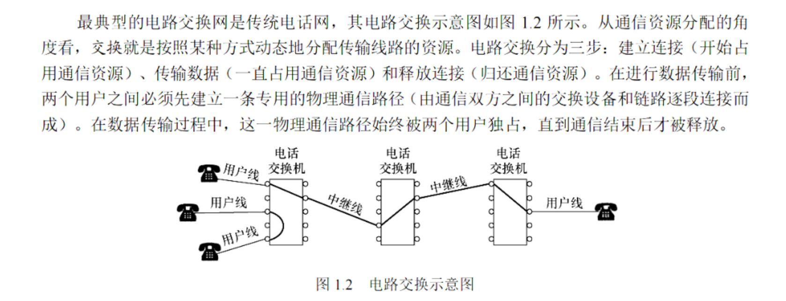

**1.1-2.** 电路交换适用方向

**答**： 低频次，连续，大量的数据传输

**1.1-3.** 为什么电路交换不适用于计算机通信，哪个最适合

**答**： 计算机通信为突发式，通信通道空闲率高。分组交换最适合

**1.1-4.** 计算机网络的定义关键词

**答**： ① 地理位置不同 ② 独立功能（自治）③ 通过通信设施互连 ④ 遵循网络协议 ⑤ 目的：资源共享+信息传递

**1.1-5.** 计算机网络五大功能

**答**： ① 数据通信（最基本**且最重要**）② 资源共享③ 分布式处理 ④ 提高可靠性 ⑤ 负载均衡

**1.1-6.** 网络从组成上分为哪几部分？

**答**： 从**组成部分**看：硬件、软件、协议三大部分  
硬件：主机、通信链路、交换设备、通信处理机  
软件：网络操作系统、应用软件、管理软件  
协议：计算机网络的核心  
从**功能组成**看：通信子网+资源子网  
从**工作方式**看：边缘部分+核心部分

**1.1-7.** 电路交换、报文交换、分组交换的区别？

**答**： 电路交换：建立专用通路，时延小但信道利用率低  
报文交换：存储转发整个报文，利用率高但时延大  
分组交换：存储转发小分组，效率高时延小但有额外开销

**1.1-8.** 数据报方式和虚电路方式的区别？

**答**： 数据报：不需要建连、每个分组独立路由、可能乱序；**不保证可靠通信**（可靠性由用户主机保证），但对网络故障的适应能力强，可另选路径  
虚电路：需要建连、建连时确定路由、按序到达；**可靠性由网络自身保证**，但节点故障影响大

**1.1-9.** 计算机网络按覆盖范围分为哪几类？

**答**： PAN(\~10m)：蓝牙、ZigBee  
LAN(\~1km)：以太网、WiFi  
MAN(\~10km)：城域网  
WAN(\>100km)：Internet

**1.1-10.** 速率、带宽、吞吐量的区别？

**答**： 速率：单位时间传输数据量，单位bps  
带宽：线路最高传输速率，单位bps  
吞吐量：实际通过的数据量，≤带宽

**1.1-11.** 四种时延的计算公式？

**答**： 发送时延=数据帧长度(bit)/发送速率(bps)  
传播时延=信道长度(m)/信号传播速率(m/s)  
处理时延+排队时延  
总时延=发送+传播+处理+排队

**1.1-12.** 易错：传播时延与什么有关？

**答**： 传播时延只与信道长度和信号传播速率有关  
与数据量无关！  
发送时延才与数据量有关

**1.1-13.** 信道利用率公式

**答**： D=D₀/(1-U)  
D₀：空闲时时延  
U：利用率  
信道利用率越高→网络时延越大

## 1.2 体系结构与参考模型

**1.2-1.** 协议三要素

**答**： 语法：数据与控制信息的结构/格式  
语义：需要发出何种控制信息，完成何种动作，做出何种应答  
时序：事件实现顺序的详细说明

**1.2-2.** 协议、接口、服务的关系

**答**： 协议：控制两个对等实体通信的规则  
接口：同一系统相邻两层的交互点（SAP）  
服务：下层为上层提供的功能  
同层之间用协议，相邻层之间用接口，下层向上层提供服务

**1.2-3.** OSI七层模型各层功能？

**答**： 7应用层：用户与网络接口  
6表示层：数据表示、加密、压缩  
5会话层：建立管理终止会话，实现数据同步  
4传输层：端到端可靠传输  
3网络层：路由分组转发  
2数据链路层：帧传输差错控制  
1物理层：比特传输

**1.2-4.** TCP/IP四层与OSI七层的对应？

**答**： 应用层 ← 应用层+表示层+会话层  
传输层 ← 传输层  
网际层 ← 网络层  
网络接口层 ← 数据链路层+物理层

**1.2-5.** 各层PDU名称

**答**： 应用层→数据  
传输层→报文段(TCP)/用户数据报(UDP)  
网络层→分组/包  
数据链路层→帧  
物理层→比特流

**1.2-6.** 各层常用协议和设备

**答**： 应用层：HTTP/FTP/SMTP/DNS  
传输层：TCP/UDP  
网络层：IP/ICMP/ARP/OSPF → 路由器  
数据链路层：以太网/PPP → 交换机/网桥  
物理层：→ 集线器/中继器

**1.2-7.** OSI与TCP/IP的主要区别

**答**： OSI：7层、先有模型后有协议、网络层面向连接+无连接、理论参考  
TCP/IP：4层、先有协议后有模型、网络层只支持无连接、实际使用

**1.2-8.** 面向连接vs无连接服务

**答**： 面向连接：通信前必须建立连接，如TCP、电话  
无连接：不需要建连，如UDP、IP

**1.2-9.** 数据封装过程

**答**： 应用层\[数据\]  
→传输层\[TCP头\]\[数据\]报文段  
→网络层\[IP头\]\[TCP头\]\[数据\]分组  
→数据链路层\[帧头\]\[IP头\]\...\[帧尾\]帧  
→物理层比特流  
每一层加本层控制信息

**1.2-10.** 网络分层的基本原则

**答**： ① 每层功能明确 ② 层间接口清晰 ③ 各层独立 ④ 促进标准化  
目的：降低复杂度、独立发展、便于标准化、易于实现维护

# 第2章 物理层

## 2.1 通信基础

**2.1-1.** 奈奎斯特定理（***无噪声理想***信道）

**答**： 理想低通信道的极限数据传输率=2W×log₂(V)  
极限码元传输速率2W  
信道带宽越大，其传输码元能力越强

W：信道带宽，单位 Hz

V：信号状态数/码元种类数

**2.1-2.** 香农定理（***有噪声现实***信道）

**答**： 实际信道下带宽受限且带有高斯噪声干扰的信道的极限数据传输速率=Wlog~2~(1+S/N)  

- W：信道带宽，单位 Hz
- S：信号功率
- N：噪声功率
- S/N：信噪比**(无单位记法)**
- 信噪比采用分贝记法后，信噪比=10lg(S/N),此时单位为分贝

注意：

①该公式给出的是理论极限

②信道带宽或者信噪比越大，信道的极限传输速率越大

**2.1-3.** 奈奎斯特vs香农的本质区别

**答**： 奈奎斯特：无噪声的理想信道，限制码元传输速率  
香农：有噪声的实际信道，限制数据传输速率  
两者取较小值作为实际极限

**2.1-4.** 曼彻斯特编码和差分曼彻斯特

**答**： 曼彻斯特：码元中间跳变，↓=1↑=0，效率50%  
差分曼彻斯特：码元开始处跳变表示数据，有跳变=0无跳变=1，中间仍跳变用于同步  
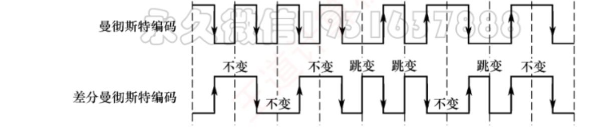  
快速区分：跳变方向与1,0对应的是曼彻斯特，不对应是差分曼彻斯特

**2.1-5.** 数字→模拟调制方式

**答**： ASK：调幅  
FSK：调频  
PSK：调相  
QAM：正交幅度调制（ASK+PSK）

**2.1-6.** 模拟数据编码为数字信号（PCM）

**答**： 脉冲编码调制PCM：采样→量化→编码  
采样频率≥2倍最高频率（奈奎斯特采样定理）  
用于电话系统

**2.1-7.** 归零编码？优缺点？

**答**：

- 简写RZ
- 规则：高电平=1、低电平=0（可相反）；**每个码元中间都跳回零电平**（所以叫\"归零\"）
- 同步：靠\"归零\"这个跳变**自同步**，收发双方无需额外时钟线
- 缺点：归零过程**占用一部分带宽**，传输效率受影响

**2.1-8.** 非归零？优缺点

**答**：

- 简写NRZ
- 规则：低电平=0、高电平=1（可相反）；**不归零**，整个码元周期都用于传数据
- 优点：**编码效率最高**（无归零浪费）
- 缺点：码元间**无间隔标志、不含同步信息**，收发双方需**额外时钟线**同步

**2.1-9.** 反向非归零？优缺点

**答**：

- 简写：NRZI
- 规则：看**码元起始处有无跳变**------无跳变=1，有跳变=0（可依协议约定互换）
- 特点：跳变本身可**辅助时钟恢复**，兼顾 NRZ 的高效率与一定的自同步能力，又避免 RZ 的带宽浪费
- 应用：**USB 2.0** 等标准采用

**2.1-10.** 按\"数据表示 / 同步方式 / 效率 / 典型应用\"对比五种编码

**答**：

| 编码            | 数据表示                         | 同步                 | 效率/带宽              | 应用               |
|-----------------|----------------------------------|----------------------|------------------------|--------------------|
| RZ 归零         | 电平高低，中途归零               | 归零跳变自同步       | 归零占带宽，效率受影响 | ---                |
| NRZ 非归零      | 电平高低，不归零                 | **无**，需额外时钟线 | 效率最高               | ---                |
| NRZI 反向非归零 | 起始处有无跳变                   | 跳变辅助时钟恢复     | 效率高、无带宽浪费     | USB 2.0            |
| 曼彻斯特        | 中间跳变**方向**                 | 中间跳变自同步       | 频带 = 基带 ×2         | 传统以太网         |
| 差分曼彻斯特    | 起始处有无跳变（中间跳变仅同步） | 中间跳变自同步       | 频带 = 基带 ×2         | 令牌环网等高速网络 |

**2.1-11.** ASK、FSK、PSK 分别靠什么区分 1 和 0？各自特点？

**答**：

| 方式         | 改变载波的 | 举例               | 特点                     |
|--------------|------------|--------------------|--------------------------|
| ASK 幅移键控 | **振幅**   | 有载波=1、无载波=0 | 易实现，**抗干扰能力差** |
| FSK 频移键控 | **频率**   | 频率 f₁=1、f₂=0    | 易实现，**抗干扰能力强** |
| PSK 相移键控 | **相位**   | 相位 0=1、π=0      | 属于**绝对调相**         |

- ⚠ 易错：ASK 抗干扰**差**、FSK 抗干扰**强**，别记反

**2.1-12.** 什么是 QAM？QAM-16/QAM-64 是什么？数据传输速率如何计算？

**答**：

- 原理：**载波频率相同**的前提下，**同时调制振幅和相位**，形成复合信号 → 有限带宽内实现更高速率
- 实现：基于**两路正交载波**（正弦+余弦，频率相同、相位差 90°），互不干扰
- 状态数：QAM-16 = 每路 4 振幅 → 4×4=**16 种状态** → 每码元 **4 比特**（16=2⁴）；QAM-64 = 每路 8 振幅 → **64 种状态** → 每码元 **6 比特**（64=2⁶）
- 星座图：每个点 = 一种状态 = 一个二进制数；接收端判断信号最接近哪个星座点来恢复数据
- 速率公式：**R = B × log₂(m×n)**（b/s），B=波特率，m=相位数，n=每相位振幅数
  - 三步：① 状态数 N=m×n → ② 每码元比特=log₂N → ③ R=波特率×每码元比特
  - 例【习题15】：8 相位×2 幅度、1200 Baud → N=16、log₂16=4 → R=1200×4=**4800 b/s**
- ⚠ 波特率（每秒码元数 Baud）≠ 比特率（每秒比特数 b/s），只差 log₂N 因子；真题写法是 **QAM-16**（数字在后）

**2.1-13.** 中继器、集线器能否分割冲突域和广播域？谁才能分割？

**答**：

- **物理层设备（中继器、集线器）：冲突域 ✗ 广播域 ✗**（都不能分割，还增大冲突范围）
- 集线器连的工作站：**同属一个冲突域，也同属一个广播域**
- 分割冲突域：**数据链路层**设备（网桥、二层交换机）
- 分割广播域：**网络层**设备（路由器）

**2.1-14.** 中继器，放大器，集线器区别

**答**：

- 中继器：**数字信号**，**信号再生**（整形+放大），减少失真，扩大传输距离
- 放大器：**模拟信号**，简单放大，**噪声也放大**、引发失真
- 集线器：**多端口的中继器**，广播式转发，无寻址，不分割冲突域/广播域
- 一句话：**再生≠放大；多端口中继器=集线器**

## 2.2 传输介质

**2.2-1.** 双绞线、同轴电缆、光纤的区别

**答**： 双绞线：便宜易装，抗干扰弱，局域网最常用  
同轴电缆：抗干扰强，带宽高，有线电视  
光纤：带宽极高，抗干扰，贵，骨干网

**2.2-2.** 单模光纤vs多模光纤

**答**：

| 多模      | 单模                              |                                                                    |
|-----------|-----------------------------------|--------------------------------------------------------------------|
| 光线      | 多条不同角度光线同时传输，全反射  | 纤芯细到接近波长，单一模式、几乎无反射，**沿直线传播**（如同波导） |
| 光源      | 发光二极管即可                    | 必须用**定向性优良的半导体激光器**                                 |
| 损耗/距离 | 损耗大，**短距离**                | 衰减小，数千米\~数十千米**无中继**，**远距离**                     |
| 原理      | 各光线路径不同→输出脉冲被**展宽** | 无反射、无展宽                                                     |

**2.2-3.** 双绞线类别

**答**： UTP=非屏蔽，STP=屏蔽

**2.2-4.** 双绞线绞合度提升或者增加屏蔽层的影响

**答**： 抗电磁干扰能力提升  
噪声功率下降  
可支持更高的数据传输速率（不是下降）

**2.2-5.** 10Base\*T代表什么

**答**： 10Mbps的双绞线，\*可为其它信息

**2.2-6.** 10Base5代表是什么

**答**： 10Mbps的同轴电缆，最远可传500m

**2.2-7.** 10F\*代表什么

**答**： 10Mbps的光纤，\*代表介质信息

**2.2-8.** 同轴电缆为什么比双绞线传输速率高

**答**： 同轴电缆有更高的屏蔽性和抗噪声性

**2.2-9.** 无线电波特点

**答**： 穿透力强，传播远，信号全方向扩散，波长λ越小，指向性越强

**2.2-10.** 微博，红外线，激光的共同点

**答**： 指向性强

**2.2-11.** 光纤的优点

**答**：

1.  **传输损耗小、中继距离长** → 远距离传输特别经济
2.  **抗雷电和电磁干扰能力强** → 适合大电流脉冲干扰的环境（如变电站、电气化铁路附近）
3.  **无串音干扰、保密性好** → 不易被窃听或截取数据，适合保密要求高的场合
4.  **体积小、重量轻** → 适合电缆管道已拥塞的场合

## 2.3 物理层设备

**2.3-1.** 中继器的功能和特点

**答**： 功能：信号再生/整形+放大***（不是简单放大）***  
工作层次：物理层  
不能连接不同速率链路  
不能隔离冲突域

**2.3-2.** 以太网5-4-3规则

**答**： 5：最多5个网段  
4：最多4个中继器  
3：只有3个网段可连接计算机  
原因：延迟累积可能导致冲突检测失败

**2.3-3.** 集线器的功能和特点

**答**： 功能：多端口中继器  
工作层次：物理层  
接收到的信号向所有端口广播  
所有端口共享带宽  
所有端口在同一冲突域

**2.3-4.** 集线器vs交换机的本质区别

**答**： 集线器：物理层，广播转发，共享带宽，所有端口同一冲突域  
交换机：数据链路层，根据MAC转发，每端口独享带宽，每端口隔离冲突域

**2.3-5.** 信号放大器vs信号再生器

**答**： 放大器：简单放大信号（包括噪声）  
再生器（中继器）：重新生成信号（整形+放大），去除噪声  
中继器是再生不是放大！

# 第3章 数据链路层

## 3.1 数据链路层的功能

**3.1-1.** 数据链路层需要解决哪三个基本问题？

**答**： 封装成帧、透明传输、差错检测

**3.1-2.** 链路、数据链路、帧、MTU 分别是什么？

**答**： 链路：相邻节点间的一段物理线路  
数据链路：链路 + 协议软硬件（逻辑通道）  
帧：链路层 PDU（协议数据单元）  
MTU：帧数据部分长度上限（最大传送单元）

**3.1-3.** OSI 与 TCP/IP 模型中，流量控制分别由哪层负责？

**答**： OSI → 数据链路层（调节相邻节点间流量）  
TCP/IP → 主要由传输层（端到端）

**3.1-4.** 链路层与传输层流量控制的"控制手段"有何不同？

**答**： 链路层：接收方来不及接收就"不返回确认"  
传输层：确认报文段中携带窗口字段，动态调整发送窗口大小

**3.1-5.** 有线链路与无线链路对可靠传输的要求有何不同？

**答**： 有线（误码率低）：链路层只做 CRC 检错、出错帧直接丢弃，重传交给 TCP  
无线（误码率高）：链路层必须提供可靠传输服务

**3.1-6.** 数据链路层差错处理的"核心原则"是什么？

**答**： 确保上交的帧无差错，但不保证所有帧都被成功交付

**3.1-7.** 数据链路层五大功能

**答**： ① 封装成帧 ② 透明传输 ③ 差错控制 ④ 流量控制 ⑤ 链路管理

**3.1-8.** 链路vs数据链路

**答**： 链路：两个相邻节点之间的物理线路  
数据链路：链路+必要的通信协议（加上控制信息的逻辑链路）

**3.1-9.** 封装成帧的作用

**答**： 在数据前后添加首部和尾部，构成帧  
作用：① 帧定界 ② 差错检测 ③ 透明传输

**3.1-10.** 透明传输的含义

**答**： 不管数据内容如何变化，数据链路层都能正确传输  
数据链路层对数据内容\"透明\"  
实现方法：字节填充法、零比特填充法

**3.1-11.** 数据链路层需要解决哪三个基本问题？

**答**： 封装成帧、透明传输、差错检测

**3.1-12.** 链路、数据链路、帧、MTU 分别是什么？

**答**： 链路：相邻节点间的一段物理线路  
数据链路：链路 + 协议软硬件（逻辑通道）  
帧：链路层 PDU（协议数据单元）  
MTU：帧数据部分长度上限（最大传送单元）

**3.1-13.** OSI 与 TCP/IP 模型中，流量控制分别由哪层负责？

**答**： OSI → 数据链路层（调节相邻节点间流量）  
TCP/IP → 主要由传输层（端到端）

**3.1-14.** 链路层与传输层流量控制的"控制手段"有何不同？

**答**： 链路层：接收方来不及接收就"不返回确认"  
传输层：确认报文段中携带窗口字段，动态调整发送窗口大小

**3.1-15.** 有线链路与无线链路对可靠传输的要求有何不同？

**答**： 有线（误码率低）：链路层只做 CRC 检错、出错帧直接丢弃，重传交给 TCP  
无线（误码率高）：链路层必须提供可靠传输服务

**3.1-16.** 数据链路层差错处理的"核心原则"是什么？

**答**： 确保上交的帧无差错，但不保证所有帧都被成功交付

## 3.2 组帧

**3.2-1.** 四种组帧方法对比，边界界定，透明传输机制，优缺点

**答**：

| 维度             | 字符计数法                                   | 字节填充法                                                    | 零比特填充法                                                             | 违规编码法                                                 |
|------------------|----------------------------------------------|---------------------------------------------------------------|--------------------------------------------------------------------------|------------------------------------------------------------|
| **定界依据**     | 帧首计数字段记录**总字节数（含自身 1B）**    | 控制字符 SOH（起始）、EOT（结束）                             | 固定标志位 **01111110**                                                  | 物理层编码中的**违规码组**（如曼彻斯特\"高-高\"\"低-低\"） |
| **透明传输实现** | 靠计数值定位，无需填充                       | 数据中遇 SOH/EOT/ESC 任一个，**其前插入 ESC**；接收方丢弃 ESC | 发送端**每遇连续 5 个 1 插 1 个 0**；接收端**每见连续 5 个 1 删 1 个 0** | **无需任何填充**，天然透明                                 |
| **优点**         | 简单                                         | 直观、易懂                                                    | **易于硬件实现**，性能优于字节填充                                       | 无填充开销，定界可靠                                       |
| **缺点/致命伤**  | **计数字段一旦出错 → 失去同步 → 灾难性后果** | 实现较复杂，存在兼容性问题                                    | 需处理 5 个 1 的扫描                                                     | **仅适用于采用冗余编码的环境**（如曼彻斯特编码）           |
| **备注**         | ---                                          | ---                                                           | 早期 HDLC 采用（⚠ HDLC 已从最新大纲删除，但思想仍要掌握）                | **IEEE802 标准采用**                                       |

**3.2-2.** 字节填充法中如何处理特殊字节？

**答**： 数据中出现 SOH(0x01)/EOT(0x04) 任一 → 其前插入 ESC(0x1B)  
数据中原本出现 ESC(0x1B) → 其前再插入一个 ESC(0x1B)  
接收方收到 ESC 就丢弃它，把紧随其后的字符当普通数据  
注：这是 3.2 组帧的字节填充法，ESC 是 ASCII 控制字符（王道 L12004）；PPP 异步传输是另一套------标志 0x7E、转义符 0x7D

**3.2-3.** 数据链路层为什么要以帧为单位传输？

**答**： 一旦出错只需重传出错的那一帧，不必重传全部数据，提高传输效率

**3.2-4.** 字节填充法如何保证透明传输？

**答**： SOH=帧起始、EOT=帧结束  
数据中遇 SOH、EOT、ESC 任一个，都在其前插入一个 ESC  
接收方丢弃 ESC，其后字符按普通数据处理

**3.2-5.** 违规编码法如何定界？适用条件？

**答**： 利用物理层编码的冗余特性：如曼彻斯特编码中"高-高""低-低"是违规码组，借用它们标识帧起止  
无需填充即可透明传输；但仅适用于采用冗余编码的环境（IEEE802 采用）

**3.2-6.** 目前更常用的组帧方法？HDLC 的注意点？

**答**： 常用：零比特填充法、违规编码法（字符计数法对错误敏感、字节填充实现复杂）  
注意：HDLC 已从最新大纲删除，但零比特填充思想仍要掌握

## 3.3 差错控制

**3.3-1.** 奇偶校验码的原理和局限

**答**： 在数据后附加1位校验位，使1的个数为奇数（奇校验）或偶数（偶校验）  
只能检测奇数位差错，不能检测偶数位差错

**3.3-2.** CRC校验的发送端和接收端

**答**： 发送端：数据后补r个0  
对生成多项式模2除  
余数作FCS  
接收端：用同一生成多项式去除，余数为0则无差错

**3.3-3.** CRC不能检验什么差错

**答**： 差错比特串能被生成多项式 G(x) 整除（即差错多项式是 G(x) 的整数倍）时检不出------所以 CRC 只能做到「漏检概率极低」，不能保证 100% 检出

**3.3-4.** 海明码的信息位长度与校验位长度的关系

**答**： 2^k^ \>= k + n + 1,k **k**表示检验位长度，n表示信息位长度

**3.3-5.** 海明码检纠错能力

**答**： 检错：检测2位差错  
纠错：纠正1位差错

**3.3-6.** 码距（海明距离）怎么算？编码集的码距是什么？

**答**： 两码字逐位异或，结果中 1 的个数。例：0110⊕0011=0101 → 码距 2  
编码集码距 = 所有码字对码距的最小值

**3.3-7.** 要检测 d 位错误，码距至少是多少？

**答**： 码距 ≥ d+1  
（d 位错后的码字不可能变成另一个合法码字；码距=1 检测不了任何错误）

**3.3-8.** 要纠正 c 位错误，码距至少是多少？一般式？

**答**： 码距 ≥ 2c+1  
一般式：l = d+c+1 且 d ≥ c（能纠错必能检错）  
例：码距=3 → 检 2 位错 或 纠 1 位错

**3.3-9.** 奇校验和偶校验的规则？

**答**： n 位数据 + 1 位检验位，使码字中 1 的个数为奇数（奇校验）/偶数（偶校验）  
例：1001101（4 个 1）→ 奇校验码 10011011、偶校验码 10011010

**3.3-10.** 奇偶校验码有什么缺陷？

**答**： 只能检测奇数个错误位；偶数个错误位的错误检不出；无法定位错误位置；码距=2

**3.3-11.** CRC 的核心思想？对生成多项式 G(x) 的要求？

**答**： 把数据看作二进制多项式，与预定义 G(x) 做模 2 运算生成 FCS 附加在数据后  
G(x) 为 r+1 阶（位串 r+1 位），最高位和最低位必须为 1。例：1101 = x³+x²+1（r=3）

**3.3-12.** CRC 发送方如何生成 FCS？

**答**： ① M 后补 r 个 0  
② 用 G(x) 做模 2 除法（减法=异或）  
③ 余数（r 位，不足补 0）= FCS  
④ 用 FCS 替换末尾 r 个 0 发送

**3.3-13.** CRC 接收方如何判断有无差错？

**答**： 对整帧用相同 G(x) 再做二进制除法：  
余数=0 → 接受；余数≠0 → 丢弃  
无错时余数必为 0，误码仍余 0 的概率极低

**3.3-14.** M=101001、G(x)=1101，求 CRC 发送的帧？

**答**： 补 0 得 101001000 → 模 2 除 1101 → 余数 001（FCS）→ 发送帧 101001001（9 位）

**3.3-15.** 海明码接收端如何定位错误？

**答**： 每组再做异或得 S₁S₂...Sₖ：全 0=无错；非 0 时该二进制值就是出错位位号，取反即纠错  
例：S₃S₂S₁=001 → 第 1 位（H1）出错

**3.3-16.** 奇数校验码与循环冗余码对比（检错能力，检测偶数位，实现，应用）

**答**：

| 维度                 | 奇偶校验码                                                                       | CRC 循环冗余码                                                                              |
|----------------------|----------------------------------------------------------------------------------|---------------------------------------------------------------------------------------------|
| **基本原理**         | n 位数据 + **1 位检验位**，使整个码字中 1 的个数为奇数（奇校验）或偶数（偶校验） | 数据看作二进制多项式，与**生成多项式 G(x)** 做模 2 运算生成**帧检验序列 FCS**，附加在数据后 |
| **冗余位数**         | 固定 **1 位**                                                                    | **r 位**（G(x) 为 r+1 阶，如 G(x)=1101 时 r=3）                                             |
| **检错能力**         | 只能检测**奇数位**错误                                                           | 检错能力强：能检测**单个比特错误**等大量错误，误码仍验不出的概率极低                        |
| **能否检测偶数位错** | ✗ 不能（偶数位错\"1\"个数奇偶性不变）                                            | ✔ 绝大多数能（不保证 100%，但工程上接受）                                                   |
| **能否定位错误**     | ✗ 不能                                                                           | ✗ 只能检错不能定位（定位是海明码的事）                                                      |
| **实现**             | 最简单,但偶数校验为硬件实现                                                      | **专用硬件电路实现**，速度极快，几乎不引入额外延迟                                          |
| **应用**             | 最基础的检错码                                                                   | 数据链路层**广泛采用**                                                                      |

**3.3-17.** 偶校验的硬件实现，接受端是怎么校验的

**答**： 把收到的数据位 + 校验位全部再异或一次（每个数字逐个异或运算）：结果 S=0 → 无错，接受；S=1 → 有错

**3.3-18.** CRC的多项式生成规则

**答**： 指定一个r+1阶多项式，最高位和最低位必须为1  
多项式做题时只是个马甲，引入多项式是因为证明CRC时引入了它，而且方便语意解释

**3.3-19.** CRC校验过程（多项式数学语意解释和形式操作解释）

**答**： **先生成r+1阶多项式G（x），注意除法过程的二进制减法实际上就是异或**  

> 

> > > > 
> > > >
> > > > |      | 形式操作（位串）          | 多项式语义（代数）             |
> > > > |------|---------------------------|--------------------------------|
> > > > | 作用 | 告诉你**怎么按位算**      | 告诉你**每一步在数学上是什么** |
> > > > | 补 0 | 末尾加 r 个 0             | 乘 xʳ                          |
> > > > | 除法 | 模 2 异或竖式             | 多项式长除法（M(x)\*xʳ/G(x)）  |
> > > > | 余数 | 竖式最终剩下的 r 位       | R(x)，次数 \< G(x) 的次数      |
> > > > | 拼帧 | 末尾 r个0 替换成 FCS      | M(x)·xʳ + R(x)==T(x)           |
> > > > | 验证 | 合成好的整帧再除G、看余 0 | 看 T(x) 能否被 G(x) 整除       |
> > > >
> > > >   

::: {style="text-align: center;"}
  
:::

**3.3-20.** 海明码的检验位怎么分布

**答**： 位于码的第2^i-1^ 位

**3.3-21.** 海明码如何通过检验位位子推出这个检验位管了哪几个信息位子

**答**： 从校验位位置开始，**连续取 i 个、跳过 i 个  
\**
P₁ (第1个): 从1开始，取1个跳1个 → 1,3,5,7,9,11... （奇数位）  
P₂ (第2个): 从2开始，取2个跳2个 → 2,3,6,7,10,11...  
P₃ (第3个): 从4开始，取4个跳4个 → 4,5,6,7,12,13...  
P₄ (第4个): 从8开始，取8个跳8个 → 8,9,...,15,24,25...

**3.3-22.** 海明码如何通过检验位位子推出哪些检验位管着它

**答**： 把信息位位号改为二进制描述，二进制里\"哪一位是 1\"，它就归哪一个校验位管  
  

| 信息位 | 位号 | 二进制（2⁰2¹2²） | 拆成 2 的幂 | 被谁管         |
|--------|------|------------------|-------------|----------------|
| D₁     | H₃   | 0 1 1            | 2⁰ + 2¹     | **P₁、P₂**     |
| D₂     | H₅   | 1 0 1            | 2⁰ + 2²     | **P₁、P₃**     |
| D₃     | H₆   | 1 1 0            | 2¹ + 2²     | **P₂、P₃**     |
| D₄     | H₇   | 1 1 1            | 2⁰+2¹+2²    | **P₁、P₂、P₃** |

**3.3-23.** 海明码的检验位是0是1怎么算

**答**： 对其管辖的信息位做异或运算得出

**3.3-24.** 海明码怎么揪出错误位次

**答**： 把检验位和它的管辖的信息位进行异或运算，S~n~ \....S~1~ 排在一起组成的二进制数就是错误码的位次

**3.3-25.** 码距：差错控制理论的公式

**答**： $l=d+c+1 \text{且}d>=c$

**3.3-26.** 怎么用差错控制原理验证海明码

**答**： **能纠 1 位错 ⟺ 码距 ≥ 2c+1 = 3**

**3.3-27.** 拓展海明码（最前面加入一位全偶检验码）的纠错检错能力？

**答**： **检 2 位 + 纠 1 位同时成立**

**3.3-28.** 拓展海明码怎么检验差错

**答**：

| S（海明校验） | 全校验 P | 判定                             | 处理                             |
|---------------|----------|----------------------------------|----------------------------------|
| 0             | 通过     | **无错**                         | 直接提取信息位                   |
| 0             | **失败** | **P 位错**（数据无损）           | 忽略/把 P 取反恢复，数据照常提取 |
| ≠ 0           | 失败     | **1 位错**（数据位或海明校验位） | 用 S 定位，取反纠正              |
| ≠ 0           | 通过     | **2 位错**                       | 只检不纠，丢弃/报错              |

## 3.4 流量控制与可靠传输机制

**3.4-1.** GBN发送窗口为什么是2\^n-1？

**答**： 序号范围0\~2\^n-1  
若窗口=2\^n，下一轮序号与上一轮混淆  
窗口=2\^n-1时不会产生序号混淆

**3.4-2.** SR发送窗口为什么是2\^(n-1)？

**答**： SR接收窗口\>1  
要求：发送窗口+接收窗口≤2\^n  
通常Wr=Wt，所以Wt≤2\^(n-1)

**3.4-3.** 累计确认vs逐帧确认

**答**： 累计确认(GBN)：确认n号帧→n及之前全部正确  
逐帧确认(SR)：每个帧单独确认

**3.4-4.** 可靠传输三要素

**答**： ① 检错（CRC等）  
② 确认（ACK）  
③ 超时重传  
三者配合才能实现可靠传输

**3.4-5.** n 比特编号时，滑动窗口协议满足什么约束？

**答**： Wt + Wr ≤ 2ⁿ  
GBN 另需 Wt ≤ 2ⁿ−1  
SR 另需 Wr ≤ Wt → Wr ≤ 2ⁿ⁻¹（常取 Wr=Wt=2ⁿ⁻¹）

**3.4-6.** 什么是 ARQ？

**答**： ARQ=自动重传请求，即确认（ACK）+ 超时重传  
*重传的请求是**自动进行**的，接收方**不需要请求发送方重传**某个出错的分组。*

**3.4-7.** GBN 接收方如何处理失序帧？

**答**： Wr=1，只按序接收，任何失序到达的帧一律丢弃（即使正确）  
发送方可连续发送窗口内多个帧

**3.4-8.** GBN 的发送窗口约束？何时性能反而差？

**答**： Wt ≤ 2ⁿ−1（否则无法区分新旧帧）  
误码率高时：出错帧后面所有正确帧都被丢弃重传 → 带宽浪费，性能可能不如停止-等待

**3.4-9.** SR 如何做到只重传出错帧？

**答**： 发送方每帧独立计时器，超时只重传该帧  
接收方缓存失序但正确的帧（缓冲区数=Wr），收齐后按序上交  
对每帧逐帧确认（非累积）

**3.4-10.** SR 中 NAK 的作用？窗口约束？

**答**： 接收方发现某帧出错可立即发 NAK 请求重传该帧，不必等超时  
约束：Wr+Wt ≤ 2ⁿ 且 Wr ≤ Wt → Wr ≤ 2ⁿ⁻¹

**3.4-11.** 链路层滑动窗口与 TCP 滑动窗口有何不同？

**答**： 链路层：窗口大小传输过程中固定  
TCP：窗口动态调整（接收方通过确认中的窗口字段控制）

**3.4-12.** 两大流量控制与可靠传输机制的关系

**答**：

- **三大 ARQ 协议（S-W、GBN、SR）都是滑动窗口协议的具体实例**------区别只在窗口大小配置不同
- **停止-等待协议是滑动窗口的子集（特例）**：W_T=W_R=1 的\"单帧滑动窗口\"。

**3.4-13.** 停止等待流量控制原理，一句话解释

**答**： 发送方**每发送一个帧就停下**等待接收方的确认，收到确认后才发送下一个帧，否则一直等待（超时则重传），从而用\"确认\"当闸门限制发送速率。

**3.4-14.** 滑动窗口流量控制基本原理的运行规则

**答**： 发送方维持一组连续序号窗口，每发送一个帧移动一下  
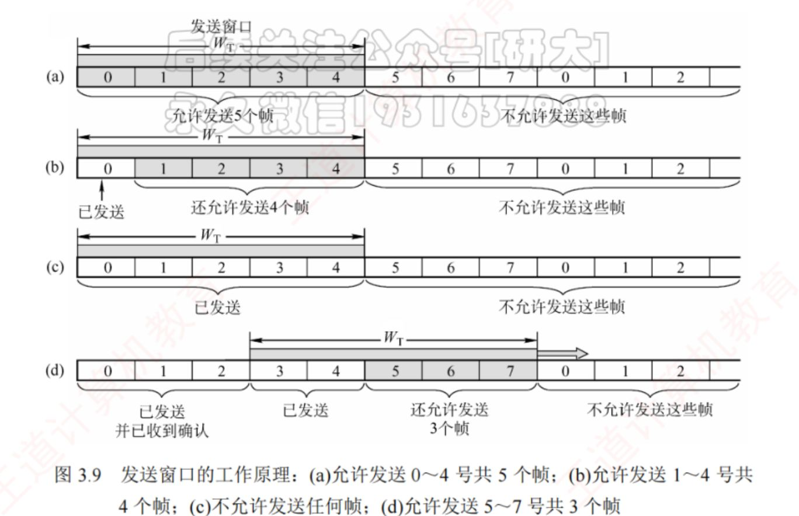  
接受窗口每收到一个，就移动一下  
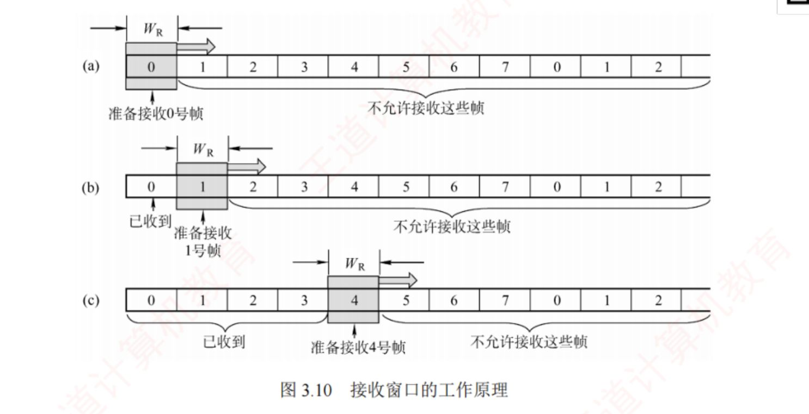

**3.4-15.** 三种窗口协议，在窗口大小上怎么分类

**答**：

| 窗口组合       | 判定结果   |
|----------------|------------|
| W_T=1, W_R=1   | 停止-等待  |
| W_T\>1, W_R=1  |  后退 N 帧 |
| W_T\>1, W_R\>1 | 选择重传   |

**3.4-16.** 滑动窗口流量控制协议的基本特征

**答**：

- 发送窗口的移动来源于接收窗口（接收方）发送的确认信息
- **数据链路层**中的滑动窗口协议，窗口大小在传输过程中是**固定**的，*和传输层不一样*

**3.4-17.** S-W会出现什么差错，怎么处理

**答**： 发送方拥有计时器，  
如果接收方发现不对直接丢弃，不会向发送方发送信息  
如果接收方发现是对的帧，但是发回的确认帧丢失在半路  
两种情况下发送方会一直等待，直到计时器超时，便会自动重传，整个流程会直到发送方收到确认帧  
当接收方已经收到正确的帧时，由于确认帧丢失，再次收到相同的帧时，会再次发送确认帧

**3.4-18.** S-W设置帧数缓冲区的理由是什么

**答**： 发送方方便重传，接收方方便确认发送方是否因确认帧丢失在重复发送

**3.4-19.** S-W为什么只需要1bit序号空间

**答**： 单帧窗口使得只需确认相邻发送的序号不重复，使用0,1交替标记

**3.4-20.** GBN 的机制原理

**答**： **1. 发送方行为（三条铁律）**  

1.  **连续发送**：可在未收到确认的情况下，连续发送窗口内所有帧（王道 3.4.2）；
2.  **一个计时器**：通常仅为**最早未确认的帧**维护一个超时计时器，该帧被确认后计时器**移至下一个未确认帧**（接力盯梢，王道 3.4.2）；
3.  **保留副本**：已发送未确认的帧必须保留副本以便重传，收到确认才清除（谢希仁 5.7.1）。

**2. 接收方行为（三条铁律）**  

1.  **按序接收**：只接收序号连续、恰好是下一个期待的帧；
2.  **丢弃**：出错帧、失序帧、重复帧一律丢弃（王道：任何失序到达的帧都将被丢弃；W_R=1 保证有序接收）；
3.  **累积确认**：对**按序到达的最大序号**发一个确认，ACK n = 「n 及之前全部正确收到」（王道 3.4.2 + 谢希仁 5.4.1）。

**3. 窗口怎么滑动**  

- 发送窗口位置由**后沿 + 前沿**共同确定；
- 收到确认 → **后沿前移**到已确认区间的后一位（累积确认下 = ACK n 的 n+1），前沿同步前移，**窗口大小不变**；
- **后沿只前移、绝不后退**（不能撤销已收到的确认）；没收到新确认则窗口不动。1

**3.4-21.** GBN的自动重传机制

**答**： **1. 触发条件**  

发送方的计时器（盯最早未确认帧）**超时**------说明该帧可能丢失或出错，且其后的帧也全部作废（接收方按序接收，早就把它们丢弃了）。

**2. 重传动作：回退 N（Go-Back-N）**  

> 

>
> 若某个已发送的数据帧因超时未收到确认而被判定为丢失或出错，则发送方**不仅需要重传该帧，还需重传其后所有已发送但未被确认的帧**。------王道 3.4.2
>
> 

> 

>
> 这就叫作 Go-back-N（回退 N），表示需要**再退回来重传已发送过的 N 个分组**。------谢希仁 5.4.1
>
> 

**3.4-22.** GBN 为什么限制窗口大小？

**答**： 序号空间 2ⁿ 有限，窗口 ≥ 2ⁿ 时新帧与重传帧序号重叠，接收方无法区分；约束 W_T ≤ 2ⁿ−1

**3.4-23.** GBN发送方连发多少个由谁决定？

**答**： **上限 = 发送窗口大小**（未收到确认时最多发 W_T 个），且不能超过接收方承受能力；窗口越大效率越高

**3.4-24.** GBN接收方收到一个就发一次 ACK 吗？

**答**： **不是标准做法**------标准是**累积确认**，对按序到达的最大序号发确认；逐个发合法但不典型

**3.4-25.** GBN收到异常帧能发 ACK 吗？

**答**： 出错帧：**不发**（静默丢弃）；失序帧：**发重复确认**（重复最近一次确认）；重复帧：丢弃并重发确认

**3.4-26.** GBN攒几个发确认有统一标准吗？

**答**： **没有固定数值**，由接收方实现决定（数量触发/时间触发）；唯一约束是**不能过分推迟**导致发送方不必要重传

**3.4-27.** GBN收到确认后把窗口尾巴挪到确认的下一位？

**答**： 方向对，精确说法：**后沿挪到已确认区间的后一位**（累积确认 = n+1），前沿同步前移，窗口整体平移、大小不变、后沿不后退

**3.4-28.** GBN计时器从发第一个帧开始计时？

**答**： 不对------**盯\"最早未确认的帧\"**，确认后接力移到下一个未确认帧

**3.4-29.** GBN等到一组最后一个帧才发确认？

**答**： 不对------**按序收到哪个序号就确认到哪个序号**（3 号丢了照样发 ACK2）

**3.4-30.** GBN超时后\"再次连续发送\"？

**答**： 不对------超时后是**重传旧帧**（回退 N），不是发送新帧

**3.4-31.** SR相较于GBN的优势

**答**： SR 出错时只重传丢失/出错的那一帧，不浪费带宽重传正确帧；而 GBN 出错时要把出错帧之后的所有未确认帧全部重传，即使它们都正确到达。

**3.4-32.** SR的自动重传机制

**答**：

| 触发方式                    | 机制                                                                                        | 对比 GBN                       |
|-----------------------------|---------------------------------------------------------------------------------------------|--------------------------------|
| **超时重传**                | 发送方为**每个未确认的帧维护独立的计时器**，某帧超时 → **仅重传该帧**                       | GBN：通常 1 个计时器，重传整批 |
| **NAK 立即重传**（SR 独有） | 接收方检测到某帧出错 → **立即发否定帧 NAK**（指明帧号）→ 发送方收到后**立即重传**，不等超时 | GBN：无 NAK，只能等超时        |

  
  

| 场景                       | 接收方动作                              | 发送方动作                                       |
|----------------------------|-----------------------------------------|--------------------------------------------------|
| **数据帧丢失**（如 2 号）  | 后续帧照收照缓存，不发 2 号的确认       | 2 号帧计时器超时 → **仅重传 2 号**               |
| **数据帧出错**（如 10 号） | 立即发 **NAK10**                        | 收到 NAK10 → **立即重传 10 号**（不等超时）      |
| **确认帧丢失**（ACK 丢了） | 收到重复数据帧 → **丢弃，重传对应确认** | 通常无感知（有独立计时器兜底；若超时会重传该帧） |

**3.4-33.** SR接收方的规则

**答**：

1.  **缓存失序帧**：接收方需设置足够大的帧缓冲区（**其数量等于接收窗口大小**），用于暂存正确的失序帧；
2.  **逐帧确认**：接收方**不能再采用累积确认，而需对每个正确接收的数据帧逐一发送确认**；
3.  **按序交付**：缺失序号的帧收齐后，再按序交付给上层。

**3.4-34.** SR发送方规则

**答**：

| \#  | 规则       | 一句话                                    |
|-----|------------|-------------------------------------------|
| 1   | 连续发送   | 未确认时可连发窗口内帧，发满 W_T 暂停     |
| 2   | 保留副本   | 未确认帧副本全保留，收到确认才清          |
| 3   | 独立计时器 | **每帧一个计时器**（GBN 通常 1 个）       |
| 4   | 超时重传   | **仅重传超时的那一帧**                    |
| 5   | NAK 重传   | 收到 NAKn → **立即重传 n 号帧**，不等超时 |
| 6   | 窗口滑动   | 依赖确认，按帧推进；受 W_T+W_R≤2ⁿ 约束    |
| 7   | 序号合法   | W_R≤W_T；各 ≤2ⁿ⁻¹，防止新旧帧混淆         |

**3.4-35.** 三种协议的信道利用率计算通用一公式

**答**： $U=\frac{W_{T}×T}{T+RTT+T_{A}}$  
  
  
$W_{T}\text{发送窗口大小（帧数）}$  
$T	\text{一个数据帧的发送时延}$  
$T_A	\text{一个确认帧的发送时延}$

**3.4-36.**

| 对比项         | 停止-等待 | GBN     | SR      |
|----------------|-----------|---------|---------|
| W_T            | 1         | 1\~2ⁿ−1 | 1\~2ⁿ⁻¹ |
| 理想利用率公式 |           |         |         |
| 能否 100%      |           |         |         |
| 速率提高时     |           |         |         |
| 误码率升高时   |           |         |         |
| 主要瓶颈       |           |         |         |

**答**：

| 对比项         | 停止-等待            | GBN                  | SR                |
|----------------|----------------------|----------------------|-------------------|
| W_T            | 1                    | 1\~2ⁿ−1              | 1\~2ⁿ⁻¹           |
| 理想利用率公式 | T/(T+RTT+T_A)        | W_T·T/(T+RTT+T_A)    | W_T·T/(T+RTT+T_A) |
| 能否 100%      | **不能**             | 能（窗口够大）       | 能（窗口够大）    |
| 速率提高时     | 利用率下降           | 不变（窗口决定）     | 不变（窗口决定）  |
| 误码率升高时   | 低但稳定             | **暴跌**（可能垫底） | 相对稳定          |
| 主要瓶颈       | 等待确认（RTT 占比） | 重传浪费             | 复杂度/窗口约束   |

**3.4-37.** 信道传输速率公式

**答**： 信道平均（实际）数据传输速率 = 信道利用率 × 信道带宽（最大数据传输速率），  
信道平均（实际）数据传输速率 = 发送周期内发送的数据量 / 发送周期。

## 3.5 介质访问控制

**3.5-1.** 信道划分介质访问控制有哪些？

**答**： TDM时分复用：按时隙分配  
FDM频分复用：按频率分配  
WDM波分复用：光纤中按光波长分配  
CDM码分复用：按码片序列分配（CDMA）

**3.5-2.** CSMA/CD 16字口诀

**答**： 先听后发，边听边发，冲突停发，随机重发

**3.5-3.** CSMA/CD最小帧长公式

**答**： 最小帧长=2τ×数据传输速率  
τ=单程传播时延  
2τ=往返传播时延=争用期  
以太网规定最小帧长=64字节=512比特

**3.5-4.** 二进制指数退避算法

**答**： 第k次冲突(k≤10)：从{0,1,\...,2\^k-1}随机选择等待时间  
超过16次冲突→报告上层失败

**3.5-5.** CSMA/CD vs CSMA/CA

**答**： CSMA/CD：有线以太网，检测冲突后重传，边听边发  
CSMA/CA：无线802.11，尽量避免冲突，先听后发，必须ACK  
无线不用CD：信号衰减大+隐蔽站问题

**3.5-6.** RTS/CTS解决什么问题？

**答**： 解决隐蔽站问题  
A向B发RTS→B广播CTS→C听到CTS后推迟发送  
A发数据→B回ACK

**3.5-7.** 令牌传递协议特点

**答**： 适用于令牌环网  
只有一个节点能发送  
不会产生冲突  
实时性好

**3.5-8.** 四类复用优缺点和限制

**答**：

| 复用方式 | 优点                             | 缺点/限制                                  |
|----------|----------------------------------|--------------------------------------------|
| 频分 FDM | 技术成熟、充分利用带宽、实现简单 | 不够灵活；需隔离频带浪费频谱；数字传输不利 |
| 时分 TDM | 技术成熟、利于数字信号传输       | 不够灵活；空闲时隙空转、利用率低；同步要求 |
| 波分 WDM | 带宽极大、可多路复用、互不干扰   | 依赖光纤介质；需要光分用器等光器件         |
| 码分 CDM | 频谱利用率高、抗干扰强、保密性好 | 实现复杂；码片需正交、扩频增加带宽开销     |

**3.5-9.** 四个复用是哪几个

**答**： ① 频分复用 FDM（按**频率**分）  
② 时分复用 TDM（按**时间**分）  
③ 波分复用 WDM（按**波长**=光的频率分）  
④ 码分复用 CDM（按**编码/码片**分）

**3.5-10.** FDM、TDM、CDM 分别\"共享/不共享\"时间与空间（频率）

**答**： FDM/WDM = 共享时间、不共享空间；TDM = 不共享时间、共享空间；CDM = 既共享时间又共享空间

**3.5-11.** 波分复用 WDM 的本质是什么？用在什么介质上？

**答**： WDM = **光的频分复用**；一根光纤同时传输多种波长光信号，波长不同互不干扰，接收端用光分用器分离；光频段带宽极大，可支持多路

**3.5-12.** 码分复用(CDMA)中，站点发送比特 1 和比特 0 分别发送什么？码片序列有什么要求？

**答**： 发 1 = 发送自己的码片序列；发 0 = 发送码片序列的**反码**；  
各站码片序列必须**相互正交**（规格化内积 = 0），才能从叠加信号中分离各路  
反码向量是正码向量的相反方向的向量

**3.5-13.** 时分复用 TDM 的最大缺点是什么？统计时分复用 STDM 如何改进？代价是什么？

**答**： TDM 固定分配时隙，用户空闲时**时隙空转、无法被他人利用 → 利用率低**；STDM **按需动态分配时隙**（有数据才分配），提高利用率；代价 = 时隙需携带**地址信息**、帧开销增加、不保证恒定速率

**3.5-14.** CDMA中接收方如何提取特定站点的信息

**答**： 把收到的数据乘以特定站点的码片，算出1代表1,算出-1代表0

**3.5-15.** 信道划分介质访问控制和随机访问介质访问控制的区别

**答**： 随机访问协议下用户通过竞争获得信道使用权，可以根据自身意愿随机发送信息  
而信道划分协议下，预先就已经分好了信道使用权

**3.5-16.** 解释纯ALOHA协议发送方规则

**答**： 用户需要发送时立刻发送数据，无需检测信道，若一段时间未收到确认帧，则等待随机时间后再次发送，直到发送成功  
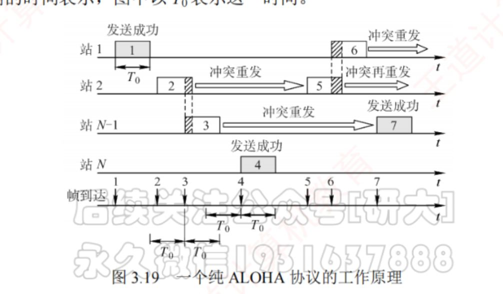

**3.5-17.** 纯ALOHA的弊端

**答**： 冲突概率高，吞吐量低

**3.5-18.** 时隙ALOHA的发送规则是什么

**答**： 所有站点同步同一个时钟，发送方随时可以发送到缓存里，但是发到信道上必须在每个时隙的起始时刻。如果发生冲突，那就等待随机整数倍时隙再发送

**3.5-19.** 时隙ALOHA的优缺点

**答**： 优点：减少发送随意性，降低冲突概率，提高信道利用率  
缺点：需要同步时钟

**3.5-20.** 时隙ALOHA对数据的要求

**答**： 数据发送时延必须小于等于一个时隙

**3.5-21.** 三种基本CSMA协议的运行区别，适用范围

**答**：

| 决策点     | 1-坚持               | 非坚持                     | p-坚持               |
|------------|----------------------|----------------------------|----------------------|
| 信道空闲时 | 概率 1 立即发        | 立即发                     | 概率 p 发 / 1-p 推迟 |
| 信道忙时   | **持续监听**直到空闲 | **放弃监听**，随机等后重听 | 等**下一时隙**再监听 |
| 适用信道   | 任意                 | 任意                       | 仅时隙化信道         |

  
若多个站点发送数据，**已经发生冲突**时，都推迟随机时间再监听

**3.5-22.**

| 维度       | 1-坚持 | 非坚持 | p-坚持 |
|------------|--------|--------|--------|
| 冲突概率   |        |        |        |
| 平均时延   |        |        |        |
| 信道利用率 |        |        |        |
| 实现复杂度 |        |        |        |
| 同步要求   |        |        |        |
| 适用负载   |        |        |        |

适用信道

**答**：

| 维度       | 1-坚持       | 非坚持         | p-坚持           |
|------------|--------------|----------------|------------------|
| 冲突概率   | **最高**     | **最低**       | 居中（可控）     |
| 平均时延   | **最低**     | **最高**       | 居中             |
| 信道利用率 | 高（及时抢） | 低（可能空等） | 中               |
| 实现复杂度 | 最低         | 低             | **最高**         |
| 同步要求   | 无           | 无             | **需要时隙同步** |
| 适用负载   | 低负载       | 中高负载       | 折中场景         |

适用信道 任意 任意 仅时隙化隧道

**3.5-23.** CSMA/CD协议工作流程

**答**： 先听先发，边听边发，冲突停发，随机重发

**3.5-24.** CSMA/CD协议发送中时监听的原理

**答**： 发送方开始发送，设传播时延为τ，当走到一半时，在τ-t时和另一个数据发生冲突，经过2(τ-t)后冲突信息发回，发送方收到后停止发送，并等待随机时间后再发送

**3.5-25.** CSMA/CD协议如果帧长太短就监听冲突失败的原理是什么

**答**： 当帧长短到发送时延极短，帧还没走到目的地，发送方就结束监听

**3.5-26.** CSMA/CD协议发生冲突后怎么解决

**答**： 进行退避，推迟随机时间，但是随机时间由特定算法决定  
设随机时间为t,k为重传次数，$K(k) = 
\begin{cases}
k, &  1<=k <=10  \\
10, &  k>10
\end{cases}$，r为数列$[0,1,\dots,2^k -1]$里随机一个数字，t=2rτ  
当k\>=16时，放弃该帧向高层报告

**3.5-27.** CSMA/CD协议适用范围

**答**： 有线总线型以太网

**3.5-28.** CSMA协议用在无线局域网上为什么不能冲突检测

**答**： 硬件成本高，收发信号强度差异大  
隐蔽站问题

**3.5-29.** 令牌传递协议刚需什么设备

**答**： 需专门设备MAU控制

**3.5-30.** 令牌传递协议的运行规则

**答**： 在IEEE802.5令牌环网络下  
在空闲时，令牌帧会循环传递  
当某一方需要发送数据帧时，必须等待令牌循环到它那里，然后修改一个标志位，将数据帧复制到令牌上，把其改为数据帧  
携带数据的令牌传递时，每个转手方会检查目的地址是不是自己，如果不是，继续转发，如果是，把数据复制下来  
最后传递回发送方，发送方检查传递途中数据是否和原来的一样，如果不是，重发

## 3.6 局域网

**3.6-1.** 802.1Q VLAN标签插入位置

**答**： 插入在源MAC地址和类型字段之间（4字节）  
原始帧→加标签后帧长1522字节  
标签包含：TPID(2B,0x8100)+TCI(2B)  
TCI含：3bit优先级+1bit CFI+12bit VID

**3.6-2.** 以太网MAC帧（V2标准）格式

**答**： 8B前导码（不属于MAC帧）+目的地址6B+源地址6B+类型2B+数据46-1500B+FCS4B  
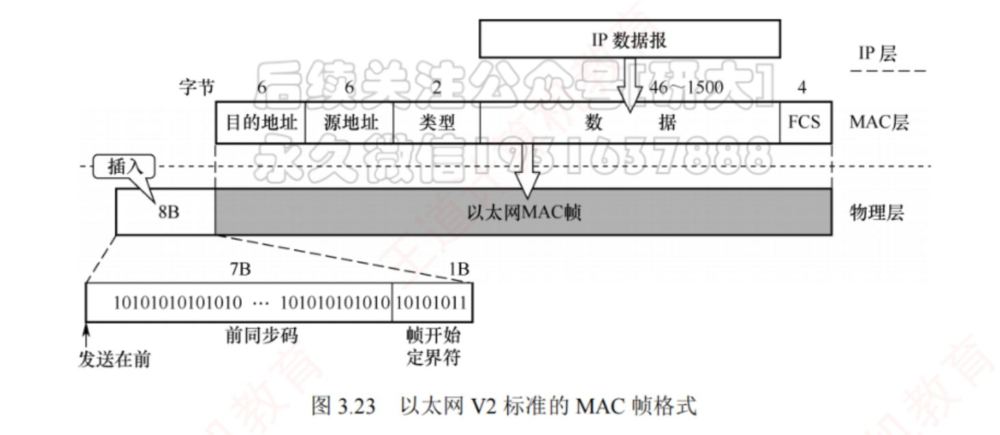

**3.6-3.** 以太网帧格式

**答**： 前导码7B+帧定界1B+目的MAC6B+源MAC6B+类型2B+数据46-1500B+FCS4B  
最小帧长64字节（不含前导码）  
最大帧长1518字节

**3.6-4.** 易混淆：最大帧长vs MTU

**答**： 最大帧长=1518字节（整个帧）  
MTU=1500字节（仅数据部分）  
\"最大帧长是1500\"→错！是1518

**3.6-5.** 10BASE-T命名规则

**答**： 10=10Mbps  
BASE=基带传输  
T=双绞线(Twisted Pair)

**3.6-6.** 高速以太网的三种类型，谁还用CSMA/CD

**答**： 100Base-T以太网，吉尔特以太网在半双工下使用CSMA/CD，由于10吉比特以太网使用全双工，无需CSMA/CD

**3.6-7.** 什么是VLAN？为什么需要？

**答**： VLAN=虚拟局域网，将物理局域网在逻辑上划分成多个广播域  
原因：① 隔离广播域 ② 增强安全性 ③ 灵活组网 ④ 简化管理

**3.6-8.** VLAN三种实现方式

**答**： 基于端口：最常用，配置简单  
基于MAC：灵活但配置复杂  
基于IP地址：跨路由扩展

**3.6-9.** 802.1Q VLAN标签

**答**： 插入在源MAC和类型字段之间（4字节）  
TPID(2B)=0x8100，标识这是 802.1Q 标签帧；TCI(2B)=3bit 优先级 + 1bit CFI + 12bit VID  
VID 是 12 位 → 取值 0\~4095，其中：  
　0：优先级标签（priority-tagged），表示该帧不带 VLAN 信息  
　4095：保留不使用  
　可用范围：1\~4094（VID 1 是默认 VLAN / 端口 PVID）

**3.6-10.** 交换机三种转发方式

**答**： ① 直通式（cut-through）：只读前 6B 目的 MAC 就转发，时延最小（100Mb/s 下约 0.48μs），不做差错检测  
② 无碎片直通（fragment-free）：先收满前 64B 再转发，用来滤掉冲突产生的残帧（长度\<64B 的 runt），时延居中  
③ 存储转发（store-and-forward）：收完整帧、校验 FCS 后再转发，时延最大但可靠，且支持不同速率端口之间转发  
注：王道 2027 正文只列 ①③ 两种（"以太网交换机主要采用两种交换模式"）

**3.6-11.** CSMA/CD最大重传次数

**答**： 最大16次  
超过16次→放弃发送，向上层报告失败

**3.6-12.** 以太网MAC协议采用的是什么服务，用的是什么编码

**答**： 无连接不可靠（尽最大努力交付），曼彻斯特编码

**3.6-13.** 适配器和局域网是通过什么介质，怎么通信的  
适配器和计算机是通过什么介质，怎么通信的  
（串行/并行？）

**答**： 通过电缆和双绞线以串行方式通信  
通过I/O总线以并行方式通信

**3.6-14.** MAC地址的构成

**答**： 48位长，前24位是厂商代码，后24位是厂商自行分配的

**3.6-15.** MAC发往本站的三种帧及其作用

**答**： 一对一单播帧，目的地址即为本站MAC  
一对全体广播帧，目的地址为FFFF FFFF FFFF  
一对多多播帧，目的地址为某个多播组地址

**3.6-16.** 以太网MAC帧中FCS的作用和前导码的作用

**答**： 前导码分为同步码7B和定界符1B,同步码是让接收方同步时钟，定界符告诉接收方同步结束下面是MAC帧本体  
FCS为32位CRC检验码，检查整个MAC帧除自身部分的正确性（不包括前导码）

**3.6-17.** 以太网MAC帧的数据部分最小长度怎么推出来,如果数据小于最小长度怎么解决

**答**： 整个MAC帧必须为64B，64-6-6-4-2=46,因此数据部分至少为46B  
数据报不足46B时，在后面添加整数字节来填充

**3.6-18.** CSMA/CD的最小帧长公式

**答**： 最短帧长 = 2 \* 最大单向传播时延 \* 数据传输速率

**3.6-19.** CSMA/CD协议的***10Mb/s***以太网征用期规定多长，最短帧长为多少，帧间最小间隔为多少

**答**： $51.2\mu s,64B,9.6\mu s$

**3.6-20.** 高速以太网和标准以太网的MAC帧格式一样吗。两个以太网的变化在哪里

**答**： 一样，便于高速以太网兼容，**变的只有速率和物理层**

**3.6-21.** 高速以太网三种类型传输介质

**答**： 100Base-T以太网：双绞线  
吉尔特以太网：双绞线或光纤  
10吉比特以太网：双绞线或光纤

**3.6-22.** 高速以太网吉比特以太网工作在半双工方式时，就必须进行碰撞检测。由于**数据率提高了**，因此只有**减小最大电缆长度或增大帧的最小长度**，才能使参数 α 保持较小。若把最大电缆长度减小到 10m，实际价值大减；若把最短帧长提高到 640 字节，发送短数据时开销又太大。该如何解决

**答**： 载波延伸（使用字节填充解决最短帧长不够）  
分组突发（解决短帧连发填充字节降低效率的问题）

**3.6-23.** 家用网路由器的构成

**答**： 路由器+交换机+AP

**3.6-24.** 校园网路由器的构成

**答**： 路由器+n个交换机+n\*m个AP

**3.6-25.** 两类无线局域网  

| 对比项     | 有固定基础设施（802.11/Wi-Fi） | 无固定基础设施（ad hoc） |
|------------|--------------------------------|--------------------------|
| 有无 AP    |                                |                          |
| 拓扑       |                                |                          |
| 最小构件   |                                |                          |
| 节点角色   |                                |                          |
| 通信必经   |                                |                          |
| 接入互联网 |                                |                          |
| 路由协议   |                                |                          |
| 覆盖范围   |                                |                          |
| MAC 协议   |                                |                          |
| 典型场景   |                                |                          |

**答**：

| 对比项     | 有固定基础设施（802.11/Wi-Fi） | 无固定基础设施（ad hoc）                       |
|------------|--------------------------------|------------------------------------------------|
| 有无 AP    | **有**（中心节点=AP/基站）     | **无**（全是对等移动站）                       |
| 拓扑       | 星形（以 AP 为中心）           | 对等/网状（临时组网）                          |
| 最小构件   | **BSS**（AP + 若干移动站）     | 无 BSS，移动站临时组                           |
| 节点角色   | 移动站只做终端                 | **兼终端与路由器**（要转发）                   |
| 通信必经   | **必须经过 AP**                | 经过中间节点存储转发                           |
| 接入互联网 | 可（经 DS/ESS/Portal）         | **一般不接入**（服务范围受限）                 |
| 路由协议   | 简单（星形集中）               | **专用路由协议**（拓扑变化快，传统协议不适用） |
| 覆盖范围   | BSA 直径 ≤100m                 | 临时、受限                                     |
| MAC 协议   | CSMA/CA                        | （自组网络也用 802.11，但结构不同）            |
| 典型场景   | 家庭/办公 Wi-Fi                | 战场、临时会议、无基站环境                     |

**3.6-26.** 无线局域网不能使用CSMA/CD协议的原因

**答**： 信号强度动态范围大  
隐蔽站问题

**3.6-27.** 简要介绍CSMA/CA协议（三种帧间间隔）

**答**： 各站发送前先检测信道，忙则禁止发送，空闲则等待一段帧间间隔再发送，时间类型，长度取决去帧的类型。

| 类型 | 名称               | 长度 | 用途                                                               |
|------|--------------------|------|--------------------------------------------------------------------|
| SIFS | 短帧间间隔         | 最短 | 分隔同一对话中的连续帧：ACK、CTS、分片后的数据帧、对 AP 探询的响应 |
| PIFS | 点协调帧间间隔     | 中等 | PCF 方式（AP 集中控制，实际很少用）                                |
| DIFS | 分布式协调帧间间隔 | 最长 | DCF 方式下发送数据帧和管理帧                                       |

  
站点检测到信道空闲时，先等待DIFS，再进争用期，接下来分情况讨论  
1. 当此发送帧为站点首次发送时，等待DIFS后立即发送数据帧  
2.若不是第一种情况，执行随即退避算法，第k次退避时在数列$[0,...,2^{4+k}-1]$随机取得一个数作为退避时间，k=6后面数列不再变长。发送方将退避数字写入退避计时器，每过一个**信道空闲的时隙后**计时器-1，归零后在信道空闲时直接发送  
  
接收方若收到了数据帧，会检验正确性，不正确则丢弃也不返回帧。若正确，等待SIFS后，（一般情况下此时信道空闲，如果忙就直接不发送等重传）会以最高优先级发送ACK帧给发送站

**3.6-28.** 简述虚拟载波监听机制

**答**： 原站发送数据时，帧首部会包含占用信道需要多久的信息，其他站听到后会设置NAV网络分配向量，自动避让

**3.6-29.** 如何缓解隐藏站问题

**答**： 使用信道预约机制  
发送方发送数据帧前，检测信道，如果空闲，等待DIFS后，广播一个RTS帧，告诉所有站需要占用多久时间（从现在到发送站收到ACK）信道  
当AP收到RTS后，等待SIFS，广播一个CTS控制帧，再次通知其它站，信道需要占用多久（从现在到发送站收到ACK），同时告诉发送站可以发送数据帧  
发送站收到控制帧后，等待SIFS，发送数据，同时帧首部包括占用时间（从现在到发送站收到ACK）  
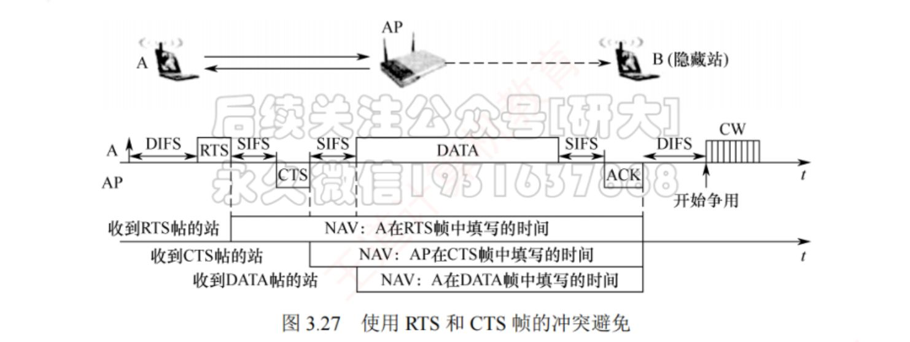

**3.6-30.** 802.11局域网帧的三个类型

**答**： 数据帧，控制帧，管理帧

**3.6-31.** 802.11 MAC帧首部的构成方式

**答**：

| 阶段                    | 去往AP/来自AP      | 地址1             | 地址2     | 地址3             | 地址4              |
|-------------------------|--------------------|-------------------|-----------|-------------------|--------------------|
| **A → AP**（站发往 AP） | 去往AP=1，来自AP=0 | AP 的 MAC         | A（源站） | **B（最终目的）** | 不用（自组网才用） |
| **AP → B**（AP 转发）   | 去往AP=0，来自AP=1 | **B（最终目的）** | AP        | **A（原始源）**   | 不用               |

**3.6-32.** VLAN标签的构成

**答**： 802.1Q标签类型 （2字节）+标签控制信息（2字节）  
802.1Q标签类型固定为0x8100  
标签控制信息=4位未使用比特位+12位VID标识

**3.6-33.** VLAN插入标准以太网帧的影响

**答**：

| 影响项               | 变化                     |     |
|----------------------|--------------------------|-----|
| **最大帧长**         | 1518B → **1522B**（+4B） |     |
| **数据字段最小长度** | 46B → **42B**            |     |
| **数据字段最大长度** | **1500B 不变**           |     |
| **最小帧长**         | **64B 不变**             |     |
| **FCS**              | **必须重新计算**         |     |

**3.6-34.** 以太网采用何种交换技术

**答**： 分组交换技术

**3.6-35.** 以太网网卡（适配器）的混杂模式规则

**答**： 工作在混杂方式的适配器，只要"听到"有帧在以太网上传输就都接收下来，而不管这些帧发往哪个站（实际上是"窃听"，但不中断其他站点通信）  
对照：只有**非混杂方式**才按单播/广播/多播三类目的地址过滤，不是发往本站的就丢弃

**3.6-36.** CSMA/CD协议下站点可以进行什么通信（半双工/全双工/都可以）

**答**： 半双工

**3.6-37.** 吉比特使用什么编码

**答**： 吉比特实际用的编码：8B/10B（光纤，IEEE 802.3z 标准）或 PAM-5（4 对 UTP5 类线，IEEE 802.3ab）  
**并非曼彻斯特编码**

**3.6-38.** 吉比特的传输时间由什么决定

**答**： 帧的发送（传输）时延 = 帧长 ÷ 发送速率 → 由**帧长**和**发送速率**共同决定，不是只由速率决定  
（1Gb/s 下同一个帧的发送时延只有 10Mb/s 的 1/100）  
正因为 1Gb/s 下发送时延变得很小，半双工时难以满足「发送时延 ≥ 2τ」，所以才要：  
· 保持最短帧长 64B、网段仍是 100m，改用**载波延伸**把争用期增大为 512B（不足 512B 的帧用特殊字符填充到 512B，接收端再删掉）  
· 短帧较多时再用**分组突发**把后面几个短帧连着发，降低填充开销  
· 全双工不使用载波延伸和分组突发

## 3.7 广域网

**3.7-1.** 广域网对应OSI层次

**答**： 物理层，数据链路层，网络层

**3.7-2.** 广域网的拓扑结构

**答**： 网状

**3.7-3.** 广域网的通信子网使用什么技术

**答**： 分组交换技术

**3.7-4.** 广域网和局域网通过什么互联

**答**： 路由器

**3.7-5.** PPP提供的是（有无连接）的（可不可靠）服务？

**答**： 有连接的不可靠服务

**3.7-6.** PPP帧的组成

**答**： 首部（5B）+IP数据报（不超过1500B，最小可为0B）+尾部（3B）  
首部=标志字段1B（固定7E）+地址字段1B（固定FF）+控制字段1B（固定03）+协议2B（IP数据报文协议为0021,LCP分组为C021）  
尾部=帧检验序列2B（CRC检验）+标志字段1B（7E）

**3.7-7.** 用户拨号接入ISP的过程

**答**： 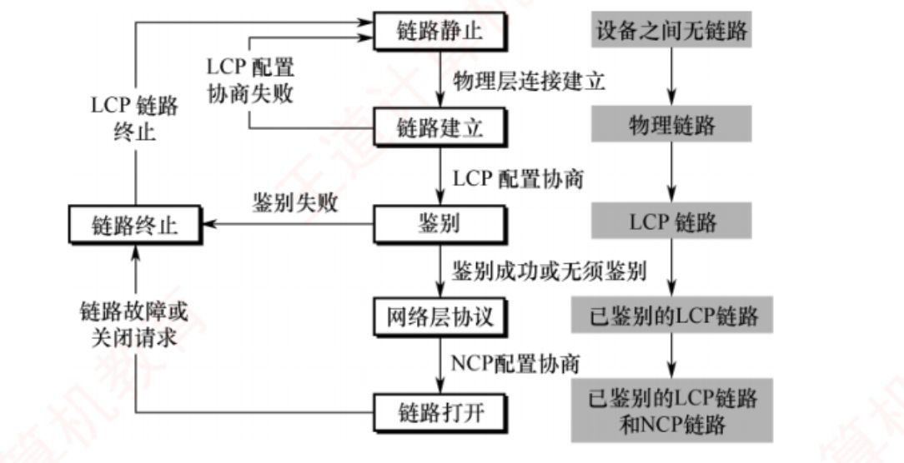

## 3.8 数据链路层设备

**3.8-1.** 交换机与集线器对冲突域，广播域范围的影响

**答**：

| 设备                | 工作层次   | 冲突域                         | 广播域     |
|---------------------|------------|--------------------------------|------------|
| **中继器 / 集线器** | 物理层     | ✗ **不分割**（所有端口同一个） | ✗ 不分割   |
| **网桥 / 交换机**   | 数据链路层 | ✔ **分割**（每个端口一个）     | ✗ 不分割   |
| **路由器**          | 网络层     | ✔ 分割                         | ✔ **分割** |

**3.8-2.** 以太网交换机和集线器的区别  

| 对比维度     | **集线器（Hub）** | **以太网交换机（Switch）** |
|--------------|-------------------|----------------------------|
| **工作层次** |                   |                            |
| **转发单位** |                   |                            |
| **冲突域**   |                   |                            |
| **广播域**   |                   |                            |
| **双工方式** |                   |                            |
| **带宽分配** |                   |                            |
| **总吞吐量** |                   |                            |
| **并行通信** |                   |                            |
| **端口缓存** |                   |                            |
| **速率互连** |                   |                            |
| **差错检测** |                   |                            |
| **转发时延** |                   |                            |
|              |                   |                            |

**答**：

| 对比维度     | **集线器（Hub）**                           | **以太网交换机（Switch）**                             |
|--------------|---------------------------------------------|--------------------------------------------------------|
| **工作层次** | 物理层（多端口转发器）                      | 数据链路层（多端口网桥）                               |
| **转发单位** | **信号（比特流）**，不缓存                  | **帧**，按目的 MAC 地址转发                            |
| **冲突域**   | 所有端口**同一个**冲突域                    | **每端口一个**冲突域（N 端口 = N 个，谢希仁原话）      |
| **广播域**   | 1 个                                        | 1 个（**不隔离**广播）                                 |
| **双工方式** | **只能半双工**（必用 CSMA/CD）              | **可全双工**（全双工下不用 CSMA/CD）                   |
| **带宽分配** | **共享**：N 用户各得 1/N                    | **独享**：每端口独占端口速率                           |
| **总吞吐量** | 不增加（合并冲突域，三个 10M 合成还是 10M） | 增加（多对端口并行 = N × 端口速率）                    |
| **并行通信** | 一个时钟周期只能传一组数据                  | **并行性**：同时连通多对端口                           |
| **端口缓存** | 无（不能缓存帧）                            | **有**（输出端口繁忙时缓存帧）                         |
| **速率互连** | 不能混速（10M 与 10/100M 混接都降到 10M）   | **可混速**（10M/100M/1G 端口任意组合 + 速率匹配）      |
| **差错检测** | 无                                          | 存储转发可检错并丢弃坏帧（直通不检错）                 |
| **转发时延** | 信号再生                                    | 直通交换≈0.48μs（6B 目的 MAC）； 存储转发交换=整帧时间 |
|              |                                             |                                                        |

**3.8-3.** 以太网交换机两种交换模式的运作方式区别

**答**： 直通交换：接受到帧的前6B即看到目的地址，直接转发  
存储转发交换：先完成接受并缓存，再进行差错检测，最后进行转发

**3.8-4.** 以太网两种交换模式的优缺点

**答**： 直通交换：转发时延小（100Mb/s 下读 6B 目的 MAC 只需 **0.48μs**；5.12μs 是争用期，不是直通时延）  
但是需要速率匹配（高速转不了低速），无法识别协议（不看VLAN标签），没有差错检测  
存储转发交换：可靠性好，支持不同速率端口转发，支持协议转换，会进行差错检测（错了直接丢弃）  
但是转发时延比较大

**3.8-5.** 交换机自学习算法的运行规则

**答**： 交换机每收到一个帧时，读取来源地址，并查找是否在转发表中，没有就添加为"XXX地址来自X号端口"  
每个表项也有老化时间，超时未更新的表项会自动删除

**3.8-6.** 交换机对不同的三种帧的转发策略

**答**： 单播帧：查看目的地址在不在转发表，不在就对除当前端口外进行广播式发送（泛洪）  
广播帧：目的MAC地址为FFFF FFFF FFFF，不查询转发表直接进行泛洪  
组播帧：执行泛洪

**3.8-7.** 交换机收到的当前帧的发送方的MAC地址在转发表中的端口，与该帧目的MAC地址在转发表的端口相同，会怎么执行

**答**： 不执行任何操作

**3.8-8.** 连接一个端口的集线器是怎么工作的

**答**： 集线器收到任何帧，都会无脑转发与他连接的所有端口

**3.8-9.** 共享式以太网和交换式以太网的对比（工作层次，通信模式，是否使用CSMA/CD，安全性）

**答**： 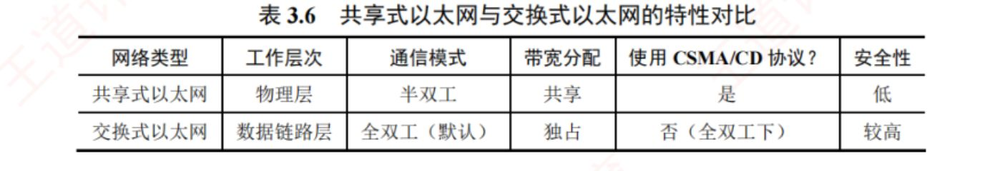

# 第4章 网络层

## 4.1 网络层的功能

**4.1-1.** 路由器的两个核心功能

**答**： 路由选择，分组转发

**4.1-2.** 虚电路的通信过程

**答**： 主机A ──▶ 节点1 ──▶ 节点2 ──▶ 主机B  
│ │ │  
①A 发「呼叫请求」分组，首部携带【完整源/目的地址】──▶ 到达节点1  
②节点1 处理：  
(a) 执行路由选择：查路由表，决定该虚电路从哪个出接口走（只此一次！）  
(b) 分配一个【本地未用的 VCID】（比如 5）  
(c) 在虚电路表登记表项：入接口+入VCID ──▶ 出接口+出VCID  
(d) 把呼叫请求转发给节点2，并告知「这条虚电路在我这侧用 VCID=5」  
③节点2 重复同样动作：选路 → 分配本地 VCID（比如 7，可与节点1不同！）  
→ 登记表项 → 转发  
④主机B 收到呼叫请求，同意通信  
⑤B 发「呼叫应答」，沿原路径返回：  
→ 每个节点把【反向】表项也登记好（虚电路是双向的，两个方向都要能查表）  
→ 应答回到主机A  
⑥建立完成：A 与 B 之间有了一条端到端的逻辑通路

**4.1-3.** 数据报的工作原理

**答**： ① 发送：A 把分组【逐个】发给与其直连的节点（路由器）A，节点短暂缓存  
② 独立选路：节点 A 查询转发表 ------ 网络状态动态变化、转发表随之更新，  
【每个分组独立进行路由选择，可能经由不同路径转发】  
（比如分组1 走 节点C 那条路，分组2 走 节点D 那条路）  
③ 逐跳转发：后续节点以相同方式转发，直到各自抵达主机 B

**4.1-4.** 虚电路与数据报特点对比  

| 对比维度              | **数据报服务**（互联网 IP） | **虚电路服务**（X.25/帧中继/ATM） |
|-----------------------|-----------------------------|-----------------------------------|
|                       |                             |                                   |
| **连接的建立**        |                             |                                   |
| **目的地址**          |                             |                                   |
| **路由选择**          |                             |                                   |
| **分组顺序**          |                             |                                   |
| **可靠性**            |                             |                                   |
| **故障适应性**        |                             |                                   |
| **差错处理/流量控制** |                             |                                   |
| **资源利用**          |                             |                                   |
| **通信同时性**        |                             |                                   |

**答**：

| 对比维度              | **数据报服务**（互联网 IP）                | **虚电路服务**（X.25/帧中继/ATM）                |
|-----------------------|--------------------------------------------|--------------------------------------------------|
|                       |                                            |                                                  |
| **连接的建立**        | **不需要**                                 | **必须有**（逻辑连接，路径固定）                 |
| **目的地址**          | **每个分组**都带完整源/目的地址（IP 地址） | 仅建立阶段用完整地址，之后分组只带**短虚电路号** |
| **路由选择**          | **每个分组独立选路**，可走不同路径         | 同一条虚电路的分组**按同一路由**转发             |
| **分组顺序**          | **不保证**有序到达（可能失序）             | **保证**按发送顺序到达                           |
| **可靠性**            | 不保证（尽最大努力交付），可靠性由用户保证 | 网络自身保证（可配合差错控制）                   |
| **故障适应性**        | **强**：可找新路径绕行                     | **弱**：经过故障节点的虚电路全部失效，需重建     |
| **差错处理/流量控制** | 由**用户主机**负责                         | 可由网络负责，也可由用户主机负责                 |
| **资源利用**          | 共享带宽，利用率高                         | 可预留资源，但可能浪费                           |
| **通信同时性**        | 多主机可同时通信（存储转发+共享）          | 同一条虚电路路径固定、按序                       |

**4.1-5.** 拥塞控制的两种方法

**答**： 开环控制：使用静态策略防止拥塞发生  
闭环控制：动态监测拥塞位置情况并反馈给控制节点

**4.1-6.** 拥塞控制和流量控制的区分

**答**： **拥塞控制**：「防止**过多的数据注入网络**，以保证网络中的**路由器或链路**不致过载」；  
**流量控制**：「抑制**发送端发送数据的速率，以便接收端来得及接收**」。

**4.1-7.** SDN三类接口的功能

**答**： 北向接口：面向应用层开发者提供编程调用API  
南向接口：实现控制层和转发设备的双向通信  
东西向接口：用于控制器内部通信

**4.1-8.** SDN的优缺点及其适用场景

**答**：

1.  **集中控制 + 分布转发**：控制平面有**全局视图**，便于统一优化（如全网流量工程）；数据平面分布式高速转发，保障性能；
2.  **灵活可编程**：通过标准化接口，开发者用软件动态定义网络行为------网络像软件一样可编程
3.  **降低成本**：控制与转发分离 → 转发硬件只需基础转发能力（变简单便宜）；
4.  **大大提高网络带宽利用率，网络运行更加稳定，管理更加高效简化，运行费用明显降低**

1.  **安全风险**：**集中化的控制器易受攻击，一旦崩溃就影响整个网络**（单点故障放大）；
2.  **性能瓶颈**：控制功能集中化后，**网络规模扩大，控制器可能成为性能瓶颈**。

  

**适用场景**：不需要改造整个互联网（互联网本质是分布式的），但**大型数据中心互联的广域网**用 SDN 能显著提升运行效率。

**4.1-9.** SDN的两个逻辑平面及其功能

**答**： SDN 的核心是**控制平面与数据平面的解耦**：**控制平面集中化、数据平面分布式部署**。传统路由器同时承担控制与转发；SDN 中由**远程 SDN 控制器**（软件，可远离交换机）统一计算流表，通过 **OpenFlow** 等协议下发给交换机。  
**SDN 不是协议，更不是一种产品。SDN 是一个体系结构，是一种设计、构建和管理网络的新方法，不是一种新型物理网络结构。**

**4.1-10.** 虚电路提供的服务一定是临时的吗

**答**： 虚电路**不只是临时性的**，它提供的服务包括**永久性虚电路（PVC）和交换型虚电路（SVC）**，其中前者是一种提前定义好的、基本上不需要任何建立时间的端点之间的连接，而后者是端点之间的一种临时性连接，这些连接只持续所需的时间，且在会话结束时就取消这种连接

**4.1-11.** 数据报，虚电路，TCP/IP模型的网络层分别提供了可靠/不可靠/有无连接服务？

**答**： **虚电路 = 有连接 + 可靠；  
数据报（TCP/IP模型在网络层） = 无连接 + 不可靠**

**4.1-12.** 虚电路需要路由选择吗

**答**： 需要，建立阶段需要

## 4.2 IPv4

**4.2-1.** IP数据报的分片原因

**答**： 由于IP数据报的大小超过了数据链路层的最大传送单元MTU

**4.2-2.** 分片过程发生在哪，重组过程呢

**答**： 分片发生在源主机和中间路由器上，重组仅在目的主机上进行

**4.2-3.** IP数据报在路由器分片的规则

**答**： **路由器收到一个 IP 数据报后，转发前的判断流程是这样的**  

1\. 查转发表 → 确定从哪个接口发出去  
2. TTL 减 1；若 TTL 变成 0 → 丢弃，发 ICMP「时间超过」  
3. 比较数据报总长度 与 出口链路的 MTU：  
├─ 总长度 ≤ MTU → 直接封装成帧转发（不分片）  
├─ 总长度 \> MTU 且 DF=1 → 丢弃！并回 ICMP「终点不可达」给源主机  

└─ 总长度 \> MTU 且 DF=0 → 进入阶段二（分片）  

- **DF=1 超长是「直接丢弃 + ICMP 差错报告」**，不是硬塞、也不是先斩后奏------这是 408 常考的一个判断题点。
- 判断发生在**出口**：进来时链路装得下不代表出去也装得下，比的是「要发出去的那段链路的 MTU」。

分片阶段：

**对数据部分进行切割**，动作如下：

1.  **算每片数据上限**：`MTU − 20`（首部），若非最后一片还要**向下取 8B 的整数倍**；
2.  **切割数据**：第一片从原始数据开头切，第二片紧接其后，直到切完；
3.  **复制首部**：每片都复制一份原始首部（**标识原样保留**，各片相同）；
4.  **修改字段**：每片只改 4 处------**总长度**（该片自己的长度）、**片偏移**（该片数据起点 ÷ 8）、**标志 MF**（非最后一片置 1，最后一片置 0）、**首部检验和**（重算，因为首部变了；王道 4.2.3）；
5.  各片**继续 TTL 的减 1 结果**、源/目的地址、标识、DF 全部不变。

> 

>
> 理解要点：分片后每片都是**一个完整的、独立的 IP 数据报**，有自己的首部和总长度，可以独自在网络上跑。
>
> 

>
> 

>
>   
>
> 

>
> 

>
> **分片后转发：**
>
> 

- 各分片**独立转发**：每片都走「查表 → 转发」流程，**可能乱序到达、甚至走不同的路径**------这正是片偏移存在的原因（没有它就无法排序重组）；
- 分片**只在中间路由器发生一次以上**：如果后面的链路 MTU 更小，已经分好的片还要再切（**二次分片**）；
- **中间路由器绝不重组**，重组只在目的主机。

**重组阶段：**

目的主机收到所有分片后：

1.  按**标识**分组：标识相同的分片属于同一个原始数据报；
2.  按**片偏移**排序：片偏移 0 的是第一片，依次衔接；
3.  找到 **MF=0** 的那片：它结束的位置 = 原始数据报数据的末尾；
4.  校验衔接连续、无重叠 → 拼装还原 → 交给上层（TCP/UDP）；
5.  **重组超时兜底**：只要有一片迟迟不到（丢失），整个数据报无法拼齐，**所有已收到的片超时后全部丢弃**（IP 是尽力而为，网络层不保证可靠，丢片由上层重传解决）。

**4.2-4.** IP数据报的首部长度部分（单位，占比，功能）  
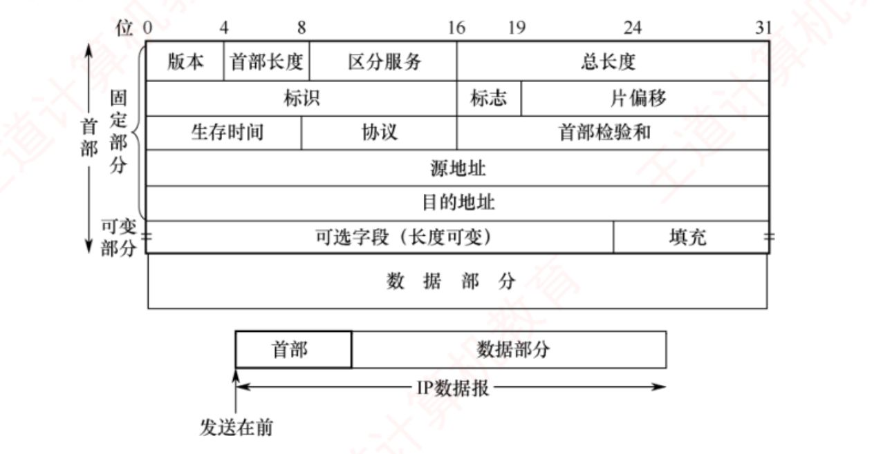

**答**： 占4位，以4B为一个单位表示首部总长度，因此IP数据报首部必须为4B整数倍，不够就填充

**4.2-5.** IP数据报的总长度部分（单位，占比，功能）  

**答**： 占16位，表首部与数据长度之和，以1B为单位

**4.2-6.** IP数据报的标识部分（单位，占比，功能）  

**答**： 16位，是数据报的识别标识，用来确认分片是否为同一组

**4.2-7.** IP数据报的标志部分（单位，占比，功能）  

**答**： 3位，只有低2位有意义，次低位DF是不能分片标志，最低位MF=1表示后面还有分片

**4.2-8.** IP数据报的片偏移部分（单位，占比，功能）  

**答**： 占据13位，以8B为一个单位，表示该分片在原始数据中距离开头的偏移量

**4.2-9.** IP数据报的生存时间部分（单位，占比，功能）  

**答**： 占8位，表示该数据报还能经过多少路由器，每经过一个-1,当TTL=0，时，路由器直接丢弃并向源主机发送ICMP

**4.2-10.** IP数据报的协议部分（单位，占比，功能）  

**答**： 8位，=6时表示TCP，=17时表示UDP

**4.2-11.** IP数据报的首部检验和部分（单位，占比，功能）  

**答**： 占 16 位，只检验首部（不含数据部分），每经过一个路由器都要重新计算  
注意：IPv4 首部检验和**必须计算**，没有「全 0 表示不检验」的开关（「检验和置全 0 = 不计算」是 UDP 的规则）

**4.2-12.** IP的网络号固定，主机号有N个，该网络下最大主机数有多少

**答**： $2^{N} - 2$

**4.2-13.** IP的A,B,C类主机号最大数，最大可用网络数以及第一个和最后一个可用网络号

**答**： 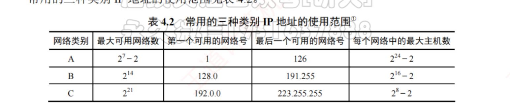

**4.2-14.** 为什么A类最大可用网络数为$2^{7}-2$

**答**： 因为A类第一位为0  
去掉一个网络号全0的作其他用处  
去掉一个0111 1111即127.X.X.X,作为环回测试

**4.2-15.** IP主机号全0是什么功能

**答**： 表示网络本身

**4.2-16.** IP主机号全1网络号非全0非全1表示什么功能

**答**： 表示该网络的直接广播地址，配合网络号对指定网络号下主机执行广播

**4.2-17.** IP地址全1功能

**答**： 此时为255.255.255.255,受限广播地址，在本地网络号下进行广播，仅可作为目的地址

**4.2-18.** IP全0的功能

**答**： 0.0.0.0表示本网络上的本主机，当前主机还没有ip地址时，源地址设定为0.0.0.0，广播DHCP报文来获取IP，DHCP服务器（特殊主机）会分配IP，仅可作为源地址

**4.2-19.** IP网络号全0是什么功能

**答**： 网络号全 0 表示「本网络」：0.0.0.0 = 本网络上的本主机，0.X.X.X = 本网络上的某主机------**只能作源地址，不能作目的地址**（常用于 DHCP）  
只能作目的地址的是 255.255.255.255（受限广播）与「Y.全1」（直接广播）

**4.2-20.** IP的A,B,C类网络号范围

**答**： A：1-126  
B：128-191  
C：192-223

**4.2-21.** 子网划分对当前网络号下最大主机数的影响

**答**： 因为各子网中**主机号全 0 和全 1 的地址不能使用**，所以**会减少总的主机数量**

**4.2-22.** 谁需要配置子网掩码

**答**： 每个网络都需要

**4.2-23.** IP的A,B,C类传统网络的子网掩码

**答**： A：255.0.0.0  
B：255.255.0.0  
C：255.255.255.0

**4.2-24.** 支持子网掩码的路由器是怎么使用子网掩码的

**答**： 将 IP数据报的目的地址 & 转发表的某一项子网掩码 == 转发表某一项的目的网络地址 & 转发表的某一项子网掩码 进行判断，相同就转发对应端口，不相同就遍历到下一项，直到通过默认子网掩码从默认端口转出去

**4.2-25.** 路由器之间交换信息时需要交换子网掩码吗

**答**： 是

**4.2-26.** 介绍CIDR

**答**： 无分类编织，不再按照ABC类传统划分，使用网络前缀替代网络号，前缀想要多长自己划

**4.2-27.** 定长子网划分的缺点

**答**： 每个子网使用相同子网掩码，IP地址数也相同，容易造成资源浪费

**4.2-28.** 路由器直接到主机的点对点链路，如何分配地址块

**答**： 划分为/30,除去两个全1全0,还有两个

**4.2-29.** 变长子网中可自由分配主机数为h bit,那么子网分配树的树高为

**答**： 树高不超过h-1,划分规则同哈夫曼树

**4.2-30.** 变长子网划分规则

**答**： 按需求定前缀长度  
先划分大子网  
每块子网都要除去全0全1主机号  
**各子网地址范围互不重叠**

**4.2-31.** 介绍路由聚合的规则

**答**： 把好几个小的地址块，合并成一个大地址块，让路由器只用记一条路由，而不是记好几条  
转发端口相同，且网络部分前缀相同

**4.2-32.** 介绍CIDR最佳匹配规则

**答**： 查找路由器转发表时，先匹配网络前缀长的端口

**4.2-33.** NAT**把哪几个网络快划作私有**

**答**： 10.0.0.0 \~ 10.255.255.255 1个A类  
172.16.0.0 \~ 172.31.255.255 16个连续的B类  
192.168.0.0 \~ 192.168.255.255 256个连续的C类

**4.2-34.** NAT是OSI什么层的协议

**答**： 网络层和传输层

**4.2-35.** NAT的工作原理  
【三个角色】  
内网主机 H ：持有专用标识 (P, s) ------ P = 私有 IP，s = 源端口  
NAT 路由器 R ：持有全球标识 (W, m) ------ W = 公网 IP（出接口），m = 映射端口  
外部主机 S ：持有全球地址，只能看到 (W, m)  
  
【一张状态表】NAT 表：{ (P, s) ⟷ (W, m) } ------ 每条活跃连接一个表项  
  
【两个方向】  
出站（H → S）：改写【源】标识： (P, s) → (W, m)  
入站（S → H）：改写【目的】标识：(W, m) → (P, s)  
  
【一个约束】入站数据包在表中找不到 (W, m) → 丢弃

**答**： ① 建表（出站首包）：H 发出 (P,s)→(S,\*)；R 分配 (W,m)，写入表项 (P,s)⟷(W,m)，把源改成 (W,m)  
② 转发：R 作为普通路由器继续转发（选路逻辑完全不变------NAT 只是「转发前后各加一次改写」）  
③ 查表（入站回包）：S 回给 (W,m)；R 查表命中 (P,s)，把目的改回 (P,s)  
④ 失效：连接结束/超时 → 删表项；之后外部再发 → 无表项 → 丢弃（回到起点）

**4.2-36.** NAT路由器和交换机对比  

| 对比维度           | 交换机转发表 | NAT 表 |     |
|--------------------|--------------|--------|-----|
| **工作层次**       |              |        |     |
| **表项内容**       |              |        |     |
| **学习信息来源**   |              |        |     |
| **建表触发**       |              |        |     |
| **建表是否有代价** |              |        |     |
| **转发动作**       |              |        |     |
| **未知目的处理**   |              |        |     |
| **方向性**         |              |        |     |
| **老化**           |              |        |     |
| **表满后果**       |              |        |     |

**答**：

| 对比维度           | 交换机转发表               | NAT 表                               |     |
|--------------------|----------------------------|--------------------------------------|-----|
| **工作层次**       | 数据链路层（二层）         | 网络层+传输层（三四层）              |     |
| **表项内容**       | 源 MAC → 接口              | (私IP:私端口) ⟷ (公IP:公端口)        |     |
| **学习信息来源**   | 帧头的**源 MAC**           | 数据报的**源 IP+端口**               |     |
| **建表触发**       | 任何主机**发过帧**即学     | 内网主机**出站首包**才建             |     |
| **建表是否有代价** | 无（纯记录）               | 有（要**分配**公网地址/端口资源）    |     |
| **转发动作**       | **不改帧**，只选端口       | **改写**源/目的地址+端口，重算校验和 |     |
| **未知目的处理**   | **洪泛**（除入接口外全发） | **丢弃**（入站无条目即丢）           |     |
| **方向性**         | 双向对称（进出都查表）     | **非对称**（出站建表、入站查表）     |     |
| **老化**           | 超时删除（表项闲置即删）   | 超时删除 + TCP 连接关闭立即删        |     |
| **表满后果**       | 洪泛增多，功能不中断       | 新连接被拒，功能中断（DoS 弱点）     |     |

**4.2-37.** NAT表的映射更新方式

**答**： 动态：内网主机发起连接，自动创建映射关系  
静态：管理员手工配置

**4.2-38.** ARP运作在哪里

**答**： 路由器和主机上

**4.2-39.** ARP表被命中，还算ARP解析过程吗

**答**： 不算，直接复用了之前的解析过程

**4.2-40.** ARP表是如何动态维护的

**答**： 当ARP表接收到对应的ARP响应分组时，写入发送方的IP及其MAC  
当ARP表接收到对应的ARP请求响应时，发送ARP响应分组，并把自己的IP,MAC写入表中  
ARP每个表项都设置生存时间，超时后自动删除

**4.2-41.** ARP表设置生存时间的原因在哪

**答**： MAC地址和IP地址有更换的可能，比如换个网卡就会更改MAC地址

**4.2-42.** 介绍主机A发送到同一网段下的主机B时，ARP表如何工作

**答**： ① A 生成 IP 数据报（源=IP_A，目的=IP_B）  
② A 用掩码判断：IP_B 与自己同网段 → 【直接交付】，不需要路由器  
③ A 要封装帧，必须知道 B 的 MAC ------ 查自己的 ARP 表  
└─ 未命中（首次通信）→ 进入 ARP 解析 ↓  
④ A 广播 ARP 请求（本网段所有主机都收到）：  
「我是 IP_A/MAC_A，谁知道 IP_B 的 MAC？」  
⑤ 全网主机的反应（各自查自己的表，不是查 A 的表！）：  
├─ B：IP 匹配 → 【单播】ARP 响应给 A：「我的 MAC 是 MAC_B」  
│ 同时把 IP_A→MAC_A 写进 B 自己的 ARP 表（顺带学习）  
└─ 其他主机：IP 不匹配 → 不回响应，也**不会新建 IP_A→MAC_A 表项**  
（RFC 826 接收算法：只有"我就是目标"时才把三元组写进转发表，非目标主机最多只能刷新已存在的表项）  
⑥ A 收到响应 → 把 IP_B→MAC_B 写入自己的 ARP 表（表项建立，开始计时）  
⑦ A 用 MAC_B 封装帧 → 发给 B  
⑧ B 收帧：目的 MAC 是自己 → 拆帧 → IP 匹配 → 交上层

**4.2-43.** 路由器要发送数据到另一路由器，ARP的变化

**答**： ① R1 查路由表：下一跳 = IP₂（R2 的入接口），出接口 = 接口 L  
② R1 查 ARP 表（按出接口 L 查 IP₂）  
└─ 未命中 → 进入解析 ↓  
③ R1 从【出接口 L】广播 ARP 请求：  
「我是 IP₁/MAC₁（在链路 L 上），谁知道 IP₂ 的 MAC？」  
⚠ 广播只在这条链路上传播------R1 的其他接口、其他网段收不到  
④ 链路上的节点反应：  
├─ R2：IP 匹配 → 【单播】响应「我的 MAC 是 MAC₂」  
│ 同时把 IP₁→MAC₁ 写入 R2 自己的 ARP 表（顺带学习）  
└─ 链路 L 上其他节点（若有）：不回响应，但顺带学 IP₁→MAC₁  
⑤ R1 收到响应 → 写入 ARP 表：IP₂→MAC₂（按接口 L 记录）  
⑥ R1 封装帧：目的 MAC = MAC₂，源 MAC = MAC₁ → 从接口 L 发出  
⑦ R2 收帧：目的 MAC 是自己 → 剥离帧首部 → 取出 IP 数据报  
→ 网络层处理（TTL 减 1、查表，继续转发或直接交付）

**4.2-44.** ARP是否对用户透明

**答**： 是

**4.2-45.** 主机A发送数据到网关R,ARP的变化

**答**： ① A 生成数据报：源 IP_A，目的 IP_B  
② A 判断 B 不在本网段 → 选择默认网关 R（配置三件套之一）  
③ A 需要 R 接口的 MAC → 查 ARP 表（IP_R → MAC_R？）  
└─ 未命中 → 广播 ARP 请求（本网段）：「谁知道网关的 MAC？」  
④ R 收到请求 → IP 匹配 → 单播响应（报自己接口的 MAC）  
→ 同时把 IP_A→MAC_A 写入 R 的 ARP 表（顺带学习）  
（本网段其他主机也收到请求 → 静默学习 A，不回复）  
⑤ A 收到响应 → 写入 ARP 表：IP_R→MAC_R → 开始计时  
⑥ A 封装帧：目的 MAC = MAC_R（网关），源 MAC = MAC_A  
帧内数据报：目的 IP 仍是 B ← 帧和报的指向不同！  
⑦ 从 A 发出 → R 收帧  
⑧ R 拆帧（目的 MAC 是自己）→ 取出数据报 → 网络层处理：  
TTL 减 1 → 查路由表 → 确定下一跳 → 重新封装（帧头换成  
R 出接口 MAC → 下一跳 MAC）→ 继续转发（此后进入「路由器→路由器」场景）

**4.2-46.** 路由器R发送到主机B，ARP的变化

**答**： ① R 收帧 → 拆帧 → 取出数据报 → TTL 减 1 → 查路由表  
└─ 命中【直连网络】条目（B 的网络）→ 不转发路由器，进入直接交付  
② R 需要 B 的 MAC → 查 ARP 表（IP_B → MAC_B？）  
└─ 未命中 → R 从出接口广播 ARP 请求（只在 B 所在网段内）  
③ B 收到请求 → IP 匹配 → 单播响应「我的 MAC 是 MAC_B」  
→ 同时把 IP_R→MAC_R 写入 B 的 ARP 表（顺带学习）  
（网段内其他主机收到请求 → 静默学 R，不回复）  
④ R 收到响应 → 写入 ARP 表：IP_B→MAC_B → 开始计时  
⑤ R 封装帧：目的 MAC = MAC_B，源 MAC = MAC_R（R 的出接口）  
帧内数据报：目的 IP = IP_B ← 两层地址指向同一台设备  
⑥ 发出 → B 收帧（目的 MAC 是自己）→ 拆帧  
→ IP 层校验（目的 IP 是 B）→ 若有分片先重组 → 交传输层/上层  
✔ 数据传输完成！

**4.2-47.** DHCP的DISCOVER报文内容（MAC帧，IP数据报，UDP,DHCP包含的数据）

**答**： MAC帧（广播帧）： 目的：全1 源：自己的MAC  
IP数据报（广播数据报）： 目的：255.255.255.255 源：0.0.0.0  
UDP数据报： 目的端口：67 源端口：68  
DHCP报文 ：表明客户端刚刚连接需要IP分配，并附上MAC

**4.2-48.** DHCP的OFFER报文内容（MAC帧，IP数据报，UDP,DHCP包含的数据）

**答**： MAC帧（广播帧）： 目的：FF-FF-FF-FF-FF-FF（全1，广播） 源：DHCP服务器的MAC  
IP数据报： 目的：255.255.255.255 源：DHCP服务器的IP  
UDP数据报： 目的端口：68 源端口：67  
DHCP报文 ：发送分配的IP地址，租用期，子网掩码，默认网关

**4.2-49.** DHCP的request报文内容（MAC帧，IP数据报，UDP,DHCP包含的数据）

**答**： MAC帧（广播帧）： 目的：全1 源：自己的MAC  
IP数据报（广播数据报）： 目的：255.255.255.255 源：0.0.0.0  
UDP数据报： 目的端口：67 源端口：68  
DHCP报文 ：写上客户端MAC和接受的IP，表示客户端已经同意接受分配的IP

**4.2-50.** DHCP的ACK报文内容（MAC帧，IP数据报，UDP,DHCP包含的数据）

**答**： MAC帧（广播帧）： 目的：FF-FF-FF-FF-FF-FF（全1，广播） 源：DHCP服务器的MAC  
IP数据报（广播数据报）： 目的：255.255.255.255 源：DHCP服务器的IP地址  
UDP数据报： 目的端口：68 源端口：67  
DHCP报文 ：再次写上分配的IP地址，租用期，子网掩码，默认网关；客户端收到后配置生效，无需再回确认

**4.2-51.** 客户端的IP租用期过50%会怎么样

**答**： 客户端向DHCP服务器发送单播请求报文，请求更新租用期  
DHCP服务器发送的同意和拒绝报文也为单播

**4.2-52.** 客户端的IP租期过87.5%会怎么样，单播还是广播，为什么

**答**： 广播请求报文，来提高续租成功率

**4.2-53.** 客户端想结束IP租用发送什么报文

**答**： 单播DHCP释放报文

**4.2-54.** DHCP采用UDP的原因

**答**： 客户端在初始阶段没有IP地址也不知道DHCP服务器的地址，无法建立TCP连接  
UDP不需要连接且支持广播

**4.2-55.** DHCP的request报文为什么采用广播

**答**： 让其他未被客户端采用IP的DHCP服务器释放自己分配出的IP

**4.2-56.** 需连接到互联网的计算机需要配置什么项目

**答**： IP,子网掩码，默认网关，域名服务器的IP地址

**4.2-57.** IP的首部是如何通过首部效验和检验的

**答**： 对首部的每个 16 比特按反码运算求和再取反码，**不是CRC,在网络层效验**

**4.2-58.** 网络层发现检验和错误会怎么做

**答**： 直接丢弃不发送任何回复

**4.2-59.** icmp五种差错报文

**答**： 终点不可达：找不到目标地址  
时间超时：达目标之前ttl归零，目标主机没有在规则时间内收到全部分片  
参数问题：数据报首部某些字段值错误  
改变路由：路由有比现状更优路径，通知主机走更优路径路由器  
源点抑制：因拥塞丢弃数据报

**4.2-60.** icmp的两种询问报文

**答**： 回送请求和回答报文：测试目的主机可达性  
时间戳请求和回答报文：估算rtt

**4.2-61.** ping指令使用icmp什么报文

**答**： 回送请求和回答报文

**4.2-62.** tracert/traceroute使用了icmp什么报文

**答**： icmp时间超时报文，通过从1逐步增加ttl追中沿途路由

**4.2-63.** 数据报片出错需要发送icmp差错报文吗

**答**： 第一片需要，后续片不需要

**4.2-64.** icmp差错报告本身错误需要发送icmp差错报文吗

**答**： 不用

**4.2-65.** 对于目的为哪几种地址的数据报出错，不发送icmp差错报文

**答**： 多播和广播地址，127.0.0.0和0.0.0.0

## 4.3 IPv6

**4.3-1.** ipv6首部长度字段还需要吗，首部长度怎么规

**答**： 不需要，首部固定40B

**4.3-2.** ipv6还需要检验首部吗

**答**： 不需要，首部检验和已删除

**4.3-3.** ipv4的ttl在ipv6叫什么

**答**： 跳数限制

**4.3-4.** ipv6的流标号功能

**答**： **流标签标记的是「网络流」**------即「从同一个源发往同一个目的、需要同样待遇的一串分组」的集合标识。

**4.3-5.** ipv6环回地址

**答**： ::1/128

**4.3-6.** ipv6未指明地址

**答**： ::/128

**4.3-7.** ipv6多播地址

**答**： FF00::/8

**4.3-8.** Iipv6本地链路单播地址

**答**： FE80::/10

**4.3-9.** IPV6分片规则和ipv4的不同

**答**： ipv6只允许源主机分片，如果路由收到数据报过大的会直接丢弃  
ipv4允许源主机和路由分片

**4.3-10.** ipv6简写规则

**答**： 组内前导0可省略  
连续个全0组可压缩为::，但是只能压缩一次

**4.3-11.** ipv4和ipv6兼容策略

**答**： 双协议栈，隧道技术

## 4.4 路由算法与路由协议

**4.4-1.** 静态路由的路由表是怎么更新的

**答**： 管理员手动配置

**4.4-2.** 距离向量算法的原理

**答**： 每台路由器**只和相邻路由器交换信息**，交换的内容是**自己到所有目的网络的距离表（距离向量）**；收到邻居的向量后，用「**走你这个邻居更近，就更新**」的规则迭代修改自己的表，直到全网收敛。

**4.4-3.** 距离向量算法更新公式

**答**： $d(x, y) = min [c(x, v) + d(v, y) ]$  

- `c(x, v)`：x 到邻居 v 的链路代价
- `d(v, y)`：从 v 到 y 的最短距离

一般距离为16时表示不可达

**4.4-4.** 介绍链路状态算法

**答**： 每台路由器**把自己知道的链路状态（与谁相邻、代价多少）洪泛给全网**，于是每台路由器都拥有一张**全网拓扑图**；然后各自用 **Dijkstra（SPF）** 算自己到所有目的的最短路径，生成路由表。

**4.4-5.** 当前主流的EGP协议为

**答**： BGP-4

**4.4-6.** 边界路由器收到RIP报文后，不同情况下的操作

**答**：

对来自相邻路由器 X 的 RIP 报文，先修改**其中所有项目**：

- 把所有项目的「下一跳」字段全部改为 **X**；
- 把所有项目的「距离」字段值**加 1**。

IF 路由表中没有 N → 加入路由表（发现新网络）  
ELSEIF 已有 N 且原下一跳是 X → 用新项目替换原表项（以最新消息为准）  
ELSEIF 已有 N 但原下一跳不是 X  
IF d\' \< 原距离 → 替换（更优路径）  
ELSE → 什么也不做

**4.4-7.** RIP协议下，边界路由器开机后0时刻先干什么

**答**： 不需要传递报文，从端口连接情况就知道和谁直连，在路由表中把他们距离设置为1,然后再向直连路由器发送rip报文交换路由表

**4.4-8.** RIP协议下，路由表每隔多久交换一次路由表

**答**： 30s

**4.4-9.** RIP路由收敛的意思

**答**： 所有路由表达到稳定状态，之后更新，只要不改变连接，所有路由表保持不变

**4.4-10.** RIP协议下，相邻路由器超过180s未联系本路由，会做什么

**答**： 把表中该路由距离设置为16表示不可达

**4.4-11.** 介绍RIP的触发更新机制

**答**： 当网络拓扑发生变化后，路由立刻发送RIP报文，不等待30s结束

**4.4-12.** RIP是哪层协议，用的是TCP还是UDP，用的什么端口

**答**： RIP为应用层协议，使用UDP，端口为520

**4.4-13.** RIP坏消息为什么传播慢

**答**：

- 正常时：R1 直连 Net1（`<Net1,1,直接>`），R2 经 R1 到 Net1（`<Net1,2,R1>`）。
- **链路故障**：R1 检测到 Net1 不可达，把自己的距离改为 16（`<Net1,16,直接>`）。
- **问题来了**：R1 **很可能要等 30 秒**（下一次周期更新）才把这个坏消息发给 R2；而**在这之前**，R2 已经先把自己的表发给了 R1，里面写着 `<Net1,2,R1>`（旧的错误信息）------谢希仁原文：R1 收到后**误认为可经过 R2 到达 Net1**，于是改成 `<Net1,3,R2>`，又发回给 R2；R2 又据此改成 `<Net1,4,R1>`......**如此往复，距离一轮轮递增**，直到双方距离都加到 **16** 才知道 Net1 不可达。
- 如同踢皮球一样，直到距离记录超过15，如果没有限制，坏消息转发会陷入无限循环

**4.4-14.** RIP坏消息传递慢怎么缓解

**答**： 水平切割：让路由器记录收到某特定路由信息的接口，而不让同一路由信息再通过此接口向反方向传送  
跳数限制：RIP 最大有效距离为 **15**，距离 **16** 即视为不可达（RFC 1058 里的 infinity，用来终止计数到无穷）

**4.4-15.** RIP协议优缺点，适用场景

**答**： 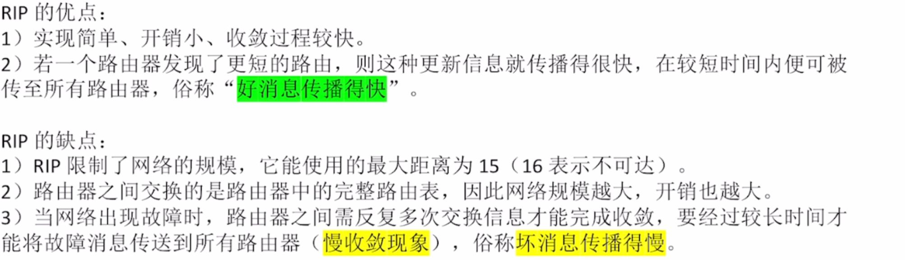

**4.4-16.** RIP收敛速度为什么慢于OSPF

**答**： RIP：收二手信息 → 信息逐跳迭代、且**依赖 30 秒定时周期** → 坏消息要顶到 16、轮次多 → **故障收敛慢**

|                                                                                                                         |
|-------------------------------------------------------------------------------------------------------------------------|
| OSFP：拿原始信息 → **触发洪泛（变化立即发）** + LSDB 全网一次同步 → 每台本地重算一次 Dijkstra 即收敛 → **无需多轮迭代** |

**4.4-17.** OSPF是什么层的协议

**答**： 网络层

**4.4-18.** OSPF数据报组成

**答**： IP首部+数据部分（OSPF首部+OSPF数据部分）

**4.4-19.** OSFP协议在IP首部协议字段为

**答**： 89

**4.4-20.** OSPF下路由器对重复收到的LSU是怎么处理的

**答**： ① 先比对 LSDB：若库里已有同一实例（序号、校验和、年龄都相同）的 LSA → 判定为重复  
② 重复的 LSA **不再洪泛转发**------不会再把同一份 LSA 扩散给其他邻居

**4.4-21.** OSPF区域过大的坏处

**答**： 洪泛压力大  
dijkstra算法运算开销大

**4.4-22.** OSPF下区域内部路由器能与谁相连

**答**： 区域内部路由器（internal router）= 所有直连网络都属于同一个区域的路由器，只跑一份基本路由算法  
→ 所以它只能与**本区域内**的路由器建立邻接关系：本区域的其他内部路由器、区域边界路由器  
→ 不能直接连到其他区域的路由器；跨区域通信必须经区域边界路由器（ABR）转发  
注：主干路由器是"有接口连到主干区域"的**另一类**，两者不能混

**4.4-23.** OSPF下，一个区域的路由刚刚开机后，经过什么来收敛的

**答**： 开机后，先与直连路由发送H分组确认通路并写入LSDB，再通过洪泛，让所有路由器获得完整的LSDB，通过dijkstra算法求出路径，以路由表的形式保存（还是保存为 连接XX，跳至XX路由）

**4.4-24.** 解释词语：LSDB,LSA,LSI以及它们的关系

**答**： LSDB（链路状态数据库）：一台路由器保存的**本区域**全网拓扑，由本区域内所有路由器发布的 LSA 组成；同一区域内的路由器 LSDB 完全一致，路由器在这张图上跑 Dijkstra 算最短路径  
LSA（链路状态通告）：路由器把自己的链路状态封装成 LSA，洪泛给本区域所有路由器  
LSI（链路状态信息）：就是 LSA 里承载的内容------**一台路由器的全部链路状态信息**（2014 统考真题里"R1 的 LSI"是一张表：Router ID + 各条 Link 及其 IP/Metric）  
关系：LSDB = 本区域所有 LSA 的集合；每个 LSA 承载发布者的整份 LSI

**4.4-25.** OSPF5种分组及其功能

**答**： 问候分组（hello）：用来发现邻居，确保双方链路通畅  
数据库描述分组（dd）：发给邻居，包含自己LSDB的摘要信息  
链路状态请求分组（lsr）：请求自己缺的/过期的那些 LSA  
链路状态更新（lsu）：按需发送lsa，可能会分成多个lsu逐个发送  
链路状态确认（lsack）：对链路更新分组确认，签收信息

**4.4-26.** 问候分组隔多久交换，多久不交换认为不可达，之后会执行什么

**答**： 10s,40s,不可达后，改自己的lsdb,再洪泛，最后重新计算路由表

**4.4-27.** OSPF下，如果之前某一时刻某路由发现邻居不可达，更新，区域全部收敛后，该邻居恢复连接，之后如何执行

**答**：

- 重新收到该邻居的 Hello → 邻居状态从 Down/Init 回到 2-Way → 建立邻接（Full）；
- **重新做 LSDB 同步**：再次走 DD（报目录）→ LSR（要缺的）→ LSU（补内容）→ LSAck；
- 同步完成后双方「完全邻接」，LSDB 一致，再一起参与 Dijkstra。

**4.4-28.** LSA的最大生存时间？每隔多久刷新一次LSA？

**答**： 60min,30min

**4.4-29.** 哪些路由器会运行BGP算法

**答**： 边界路由一定运行，部分内部核心路由也运行

**4.4-30.** BGP为什么不能找最佳路由路径

**答**： 因为互联网规模巨大，受经济政治因素，寻找最佳路由不现实

**4.4-31.** BGP是哪一层协议，使用的是TCP OR UDP

**答**： 应用层，TCP

**4.4-32.** BGP路由工作在哪几层

**答**： BGP 协议本身在**应用层**（王道原话"BGP 是应用层协议"）  
它用**传输层**的 TCP 承载（端口 179 的半永久 TCP 连接）  
交换的内容是**网络层**的可达性信息（路由）  
报文最终再经数据链路层、物理层发出  
→ 所以"运行 BGP 的路由器"从应用层到物理层全都参与，这就是"全部 5 层"的来由  
考点：BGP 属应用层协议（不是网络层协议），靠 TCP/179

**4.4-33.** BGP采用什么协议

**答**： 路径向量路由选择协议

**4.4-34.** BGP路由的格式，及各部分功能

**答**： \<前缀，AS-PATH,NEXT-HOP\>  
前缀：AS网络前缀  
AS-PATH：经过的AS路径  
NEXT-HOP：接受该BGP路由的路由器去往目的网络应该应用的下一跳IP

**4.4-35.** NEXT-HOP在什么情况下会被更改

**答**： **只要通过 eBGP 发出去（发往 AS 外），就一律写成自己的ip**

**4.4-36.** 同一个AS下的运行的BGP的路由器是怎么连的

**答**： 一一相连，都拥有ibgp会话

**4.4-37.** IBGP是物理连接还是逻辑连接

**答**： 逻辑连接

**4.4-38.** BGP通过端口号几连接，交换信息后还连接吗

**答**： 179端口半永久TCP连接（交换信息后还连接）

**4.4-39.** bgp下的bgp内部路由器，收到bgp路由会怎么做

**答**： 收到后不再转发，解析next-hop查询igp，写入路由表

**4.4-40.** 举出所有BGP路由选择算法

**答**： 本地偏好值最高的路由：由管理员手动设定本地偏好值  
AS-PATH算法：选择AS跳数最少的  
热土豆路由选择算法：调用内部网关协议，选择最快离开本AS的路径  
选择BGP标识符数值最小的路由：标识符越小表示bgp路由器资历越老，优先选择老资历

**4.4-41.** BGP四种报文及其功能

**答**： open报文：在tcp连接基础上交换该报文建立B GP会话  
update报文：通告其他路由器，更新路由  
keepalive报文：定期交换确保连通  
notification报文：发送检测到的差错

**4.4-42.** keepalive报文多久发一次，多久不发表示链路不通

**答**： 60s,180s

## 4.5 IP 多播

**4.5-1.** 多播的意义

**答**： 减轻了了服务器的负担和网络负载

**4.5-2.** 多播IP地址组成和范围

**答**： D类：1110前缀，224.0.0.0 - 239.255.255.255

**4.5-3.** IGMP协议的层次，udp/tcp,协议号为

**答**： 网络层（IP 的配套协议，不单独算一个协议）；不经 UDP，IGMP 报文**直接封装在 IP 数据报中**；协议字段 = 2

**4.5-4.** 多播报文有差错需要发icmp吗

**答**： 不需要

**4.5-5.** IP多播地址怎么转化为MAC多播地址

**答**： IP地址除去高5位，MAC地址除去前25位，两者剩下的23位一样

**4.5-6.** MAC多播地址前缀和范围

**答**： 01-00-5E,范围01-00-5E-00-00-00到01-00-5E-7F-FF-FF

## 4.6 移动 IP

**4.6-1.** 移动站是如何连上外地网络的

**答**： 移动站向外地代理登记获取临时的转交IP  
外地代理向本地代理登记该IP的转交地址

**4.6-2.** 移动站如何在外地接受IP分组

**答**： 发送方构造原始IP分组，归属代理受到IP分组后，进行IP-in-IP套娃封装，外部IP分组的源=归属代理ip,目的地址=移动站的转交地址。外地代理受到归属代理发送的套娃IP分组，拆封后得到原始IP分组，封装成MAC帧发给移动站

**4.6-3.** 移动站在外地网络怎么发送IP分组

**答**： 移动站构造哦IP分组，直接交给外地代理转发，外地代理直接转发到目的网络

# 第5章 传输层

## 5.1 传输层提供的服务

**5.1-1.** 解释复用，分用

**答**： 复用：发送方的多个应用进程共用**同一个传输层协议**传送数据（各进程的端口号不同，靠端口号区分）  
分用：接收方能让应用进程收到对应正确的数据

**5.1-2.** 解释：有连接/无连接

**答**： 双方通信前先询问，建设信道上有连接  
直接发过去数据是无连接

**5.1-3.** 解释：可靠/不可靠

**答**： 可靠：接收方类似ack确认机制  
不可靠：接收方不管收到什么，都不反馈发送方

**5.1-4.** 端口号分类和各个范围

**答**： 服务器端：熟知端口号：0-1023,登记端口号：1024-49151  
客户端：49152-65535

**5.1-5.** 套接字简要构成

**答**： IP地址：端口

**5.1-6.** TCP,UDP适用场景

**答**： TCP：对可靠性要求高  
UDP：对时延敏感，能容忍少量丢包

**5.1-7.** 面向连接的服务是否保证按顺序交付

**答**： 对

## 5.2 UDP

**5.2-1.** UDP支持 ？对？ 的通信

**答**： 一对一，一对多，多对多

**5.2-2.** UDP的可靠机制谁负责

**答**： 由应用层开发者负责

**5.2-3.** UDP首部的大小和组成

**答**： 8B，16位源端口号+16位目的端口号+16位UDP长度+16位UDP检验和

**5.2-4.** UDP实际长度最大为

**答**： 65515B

**5.2-5.** UDP源端口号设置全0,和检验和设置全0的功能

**答**： 不需要对方回复  
不使用检验和

**5.2-6.** UDP报文可以自行拆分重组吗

**答**： 不行

**5.2-7.** UDP的伪首部组成

**答**： 12B，4B源IP+4B目的IP+1B固定值0+1B固定值17+2B的UDP长度

**5.2-8.** 发送方生成UDP检验和过程

**答**： 检验和字段设置为0,把伪首部和UDP数据组合，16位为一组，最后不足16位补0,几个16位全部相加并取反（相加遵循回卷）

**5.2-9.** 接收方使用UDP检验和过程

**答**： 伪首部和数据组合，再二进制反码求和（遵循回卷），结果全1没有差错

**5.2-10.** 解释：回卷

**答**： 最高位相加产生进位，把进位加到结果最低位

## 5.3 TCP

**5.3-1.** seq的表示范围和编号规则  
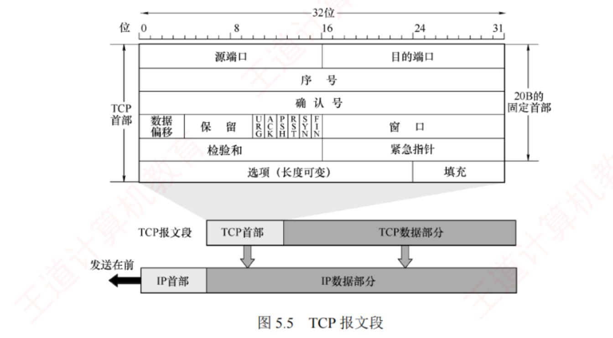

**答**： 0～2^32^-1，下一报文序号=本报文序号+本报文字节数（1B为单位）

**5.3-2.** ack_seq/ack的功能和规则  

**答**： 表示期望对方发送的下一个报文的序号

**5.3-3.** ack/ack_seq为N表达的意义  

**答**： 表示直到序号N-1的数据已全部正确接收

**5.3-4.** 数据偏移的功能，意义，表示单位，和范围  

**答**： 表示就是TCP首部长度，首部长度：20B～60B，数据偏移范围：5～15  
偏移单位为4B

**5.3-5.** URG,ACK,PSH,RST,SYN,FIN的中文名字  

**答**： 紧急位，确认位，推送位，复位位，同步位，终止位

**5.3-6.** 保留位段置几  

**答**： 0

**5.3-7.** URG的功能  

**答**： 设为1,表示该报文需要优先处理，插队发送

**5.3-8.** ACK的功能，和何时置为0  

**答**： 只有握手一时置为0。  
ACK=1表示当前报文有效，表示确认序号有效

**5.3-9.** PSH的功能和使用场景，接收方收到PSH段后怎么做  

**答**： 用于交互式通信。置1表示希望报文发出去后立即回复相应  
接收方收到PSH段后，无需等待缓存区充满，直接提交到应用层

**5.3-10.** RST的功能和使用场景  

**答**： RST=1表示必须立刻释放连接并重新建立连接  
用于主机崩溃，阻止非法报文或连接请求

**5.3-11.** SYN的功能，在TCP连接-释放哪几次置1  

**答**： 置1表示这是个连接请求报文  
只有握手一，握手二会置1

**5.3-12.** 在连接请求和连接接受报文，SYN,ACK为多少  

**答**： 连接请求：SYN=1,ACK=0  
连接接受：SYN=1,ACK=1

**5.3-13.** FIN的功能，在TCP连接-释放中何时置1  

**答**： 表示请求释放连接  
仅在挥手一，挥手三置为1

**5.3-14.** rwnd/rcwnd的范围,单位和意思  

**答**： 0～2^16^-1，单位为1B,  
表示：从当前报文的确认号开始，对方还可以连续发送多少数据

**5.3-15.** TCP 的伪首部组成,和UDP伪首部的区别

**答**： 4B的原IP+4B的目的IP+1B的0+**1B的6**+2B的TCP长度  
协议字段UDP为17,TCP为6,长度为TCP/UDP各自长度

**5.3-16.** 紧急指针的生效条件和功能

**答**： 仅当 URG=1 时有效（占 2B）  
指出本报文段中**紧急数据的字节数**（紧急数据位于数据部分开头），不额外分配序号  
即使接收窗口为 0，仍可发送紧急数据

**5.3-17.** 选项的的MSS在什么时候传递  

**答**： 在握手一、握手二（两个 SYN 报文段）里各自声明自己能接收的 MSS，**两个方向可以不同**（严格说不是「协商」，而是各自声明）

**5.3-18.** 填充字段的功能  

**答**： 确保首部长度为4B整数倍

**5.3-19.** TCP三次握手，设发送端seq初始为x,接收端seq初始为y，简述三次握手中，SYN,seq,ack,ACK的变化

**答**： 第一次:SYN=1,ACK=0,seq=x,ack无效  
第二次:SYN=1,ACK=1,seq=y,ack=x+1  
第三次:SYN=0,ACK=1,seq=x+1,ack=y+1

**5.3-20.** TCP三次握手时，客户与服务端状态变化

**答**： 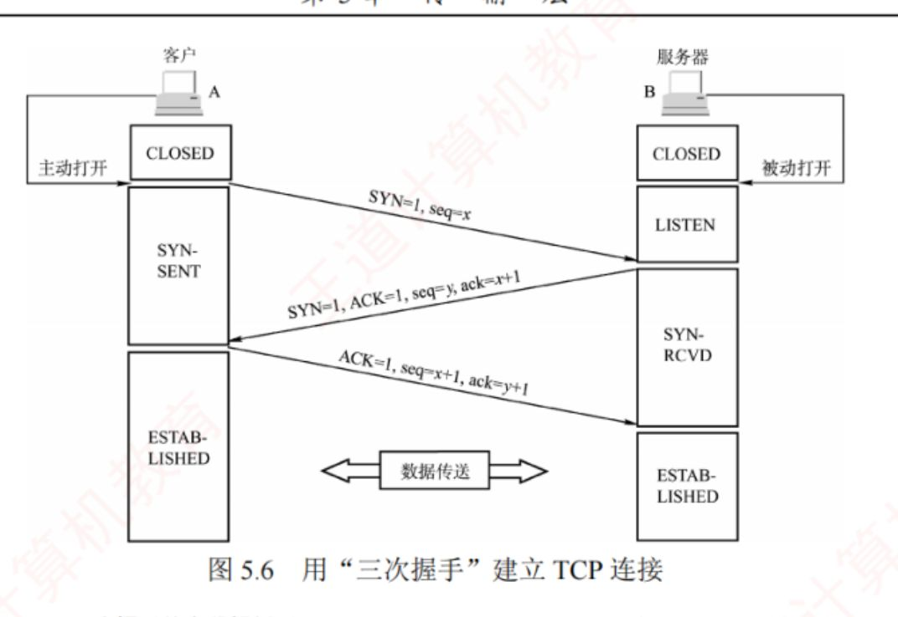

**5.3-21.** 从客户发出 SYN 报文段（第一次握手的连接请求报文段）时刻起算，客户最早可在多少RTT 后开始发送数据，而服务器最早在 多少RTT 后才能发送数据。

**答**： 从客户发出 SYN 报文段（第一次握手的连接请求报文段）时刻起算，客户最早可在1RTT 后开始发送数据，而服务器最早在 1.5RTT 后才能发送数据。

**5.3-22.** TCP四次挥手中，设发送方初始序号为m,接收方初始序号为n,有d字节数据需要传输，d可以为0，求FIN,ACK,seq,ack的变化

**答**： 挥手1：FIN=1,ACK=1,seq=m,ack=n+1（ACK=1 时 ack 字段始终有效，值 = 期望收到的下一个字节序号；本方向此前未收到数据时无实际确认含义）  
挥手2：FIN=0,ACK=1,seq=n,ack=m+1  
中途传送d字节数据  
挥手3：FIN=1,ACK=1,seq=n+d,ack=m+1  
挥手4：FIN=0,ACK=1,seq=m+1,ack=n+d+1  
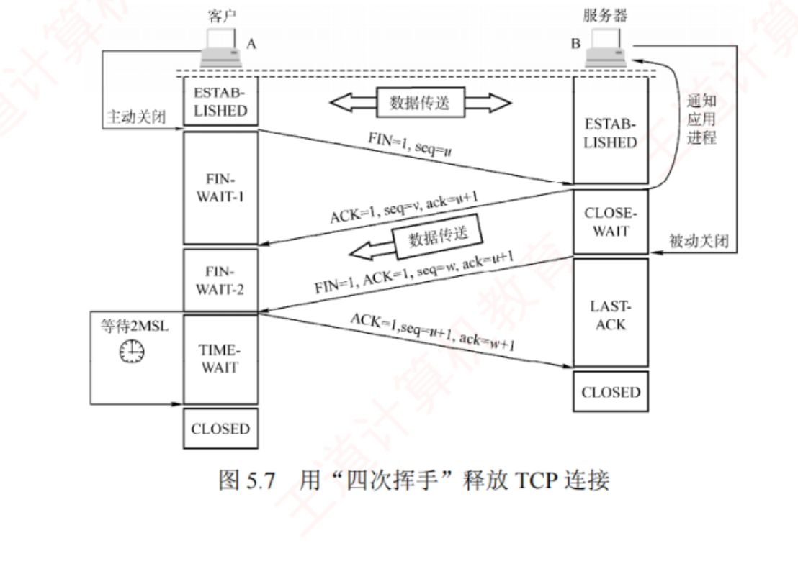

**5.3-23.** 挥手二本身消耗序号吗

**答**： 不消耗序号，只有当携带数据时消耗序号

**5.3-24.** 四次挥手中，谁一定不可以携带数据

**答**： 挥手四

**5.3-25.** 若服务器在收到客户的连接释放请求后不再发送数据，则从客户发出FIN 报文段时刻起算， 客户释放连接的最短时间为多少，服务器释放连接的最短时间为多少

**答**： 客户释放连接的最短时间为1RTT+2MSL，服务器释放连接的最短时间为1.5RTT

**5.3-26.** 四次挥手中哪几次FIN=1

**答**： 挥手一，挥手三

**5.3-27.** 设置2MSL的原因

**答**： 以防挥手四没有被接收方正确接收，接收方会再次重传挥手三，当发送方收到后计时器重置，并再次发送挥手四，否则接收方永远卡在LASTACK阶段  
保证下次连接不会被这次连接的残余数据干扰

**5.3-28.** 四次挥手中，发送方和接收方的状态变化

**答**： 

**5.3-29.** 当四次挥手不传输数据时，对状态变化的影响

**答**： FIN-WAIT-2无限趋于零

**5.3-30.** TCP保活计时器的功能

**答**： 防止对方突发故障，导致长期无效等待

**5.3-31.** 解释:累计确认机制

**答**： 即接收方返回ACK时,ack序号写的是,第一个没有收到的报文序号,即为,在该序号前的报文已全部收到

**5.3-32.** 解释:推迟确认机制(最多推迟多少,哪些特殊情况需要立即确认)

**答**： 最多推迟0.5s  
当接收方本身就有数据需要捎带,当连续收到两个长为MSS报文时,立即发送确认报文

**5.3-33.** 解释:捎带确认

**答**： 发送确认报文时,恰好也有数据需要发送,那就让确认报文顺便带走数据

**5.3-34.** 解释TCP超时重传机制

**答**： 有两种情况  
发送方发送报文直接丢失/出错,接收方未收到  
接收方收到,但是发送的确认报文丢失/出错  
对于发送方来说,均为**未收到**确认报文。发送方每发送一个报文段都会设置一个超时计时器，RTO 按自适应算法根据 RTTS 动态调整（略大于 RTTS），超时则重传该报文段

**5.3-35.** RTO过长和过短的危害

**答**： 过长:报文无法及时重传,延迟过大  
过短:错误多次重传导致传输压力变大

**5.3-36.** 介绍快重传机制

**答**： TCP 规定，每当比期望序号大的失序报文段到达时，立即发送一个几余 ACK，指明 下一个期待字节的序号。当发送方收到对同一个报文段的3个余 ACK时，可以认为紧跟在这个被确认报 文段之后的报文段已丢失,立刻对丢失报文进行重传

**5.3-37.** 接收窗口把数据传至应用层的要求

**答**： 数据必须按序且连续  
当PSH=1或者应用层主动读取时,直接上传

**5.3-38.** 流量控制和拥塞控制的区别

**答**： 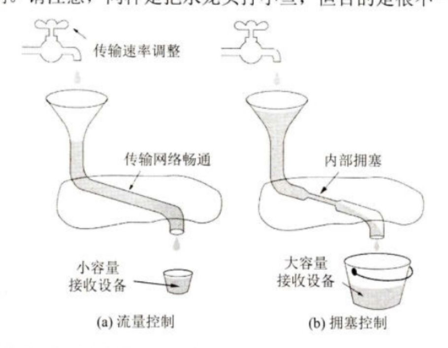

**5.3-39.** 发送窗口上限公式

**答**： $\text{发送窗口上限}=min[rwnd,cwnd]$

**5.3-40.** 慢开始算法的原理和转入拥塞避免算法的条件

**答**： 每收到一个对新报文段的确认，cwnd 加 1；因此每经过一个 RTT，cwnd 加倍（指数增长）  
当 cwnd 增长到 ssthresh 时，转入拥塞避免

**5.3-41.** 拥塞避免的原理

**答**： 每经过一个收到过报文的RTT,cwnd++

**5.3-42.** 拥塞避免转入拥塞处理的条件,和拥塞处理的方法

**答**： 检测到超时（超时重传）即进入拥塞处理  
先把 ssthresh 调整为「当前 cwnd 的一半」（但**不得小于 2**），再把 cwnd 重置为 1，然后重新执行慢开始

**5.3-43.** 介绍快恢复触发条件,原理

**答**： 触发条件：连续收到 3 个冗余 ACK（触发快重传）时进入快恢复  
ssthresh 调整为当前 cwnd 的一半，cwnd 也调整为 ssthresh（=cwnd/2），然后**直接进入拥塞避免**（不重置为 1，跳过了慢开始，故称"快恢复"）

**5.3-44.** 四次挥手在不携带数据的情况下消耗多少序号

**答**： 2个,均由两个FIN段消耗

**5.3-45.** 三次握手消耗序号多少

**答**： 2,  
2个SYN段必须消耗序号

# 第6章 应用层

## 6.1 网络应用模型

**6.1-1.** C/S模式的优缺点

**答**： 拓展性差  
服务器负载大  
服务器管理集中便捷

**6.1-2.** P2P模式的优缺点

**答**： 减轻中心服务器的压力  
可拓展性好  
网络健壮性强  
  
占用本机资源  
对互联网造成网络堵塞

**6.1-3.** CS的客户间可以联系吗

**答**： 不可

**6.1-4.** CS下客户需要知道服务器的端口和IP吗

**答**： 都要知道：必须知道服务器的 IP 地址**和端口号**（服务端口是熟知的，如 HTTP 就是 80）；服务器反而无需事先知道客户的地址

## 6.2 域名系统

**6.2-1.** DNS服务器是什么类型系统.什么模型,用的UDP还是TCP,走什么端口

**答**： 分布式系统,C/S模式,使用UDP走53号端口

**6.2-2.** 域名标号规则

**答**： 英文不区分大小写,不得使用除了-以外的标点符号  
每个标号不超过63字符,整个域名总长度不超255个字符1

**6.2-3.** 顶级域名三个分类

**答**： 国家顶级域名,通用顶级域名,基础结构域名(用于IP反解域名)

**6.2-4.** 四种类型域名类型服务器

**答**： 根域名服务器,顶级域名服务器,权限域名服务器,本地域名服务器

**6.2-5.** 解释DNS解析的递归查询,应用场景

**答**： 查询只发送一次,询问的一个服务器只要不知道,服务器就问其他服务器,直到找到知道的,再顺着查询链条返回  
主机向本地域名服务器查询一定使用该方法

**6.2-6.** 解释DNS解析的迭代查询和使用场景

**答**： 要么直接给出所查询的IP地址，要么告诉本地域名服务器："你下步应向哪个顶级域名服务器查询"。随后，由本地域名服务器向该顶级域名服务器发起新的查询 请求  
适用于本地域名服务器询问根域名服务器的过程

## 6.3 文件传输协议

**6.3-1.** FTP的的工作模式?使用什么传输层协议?

**答**： C/S 模式,使用TCP协议

**6.3-2.** FTP登录过程

**答**： S打开端口21等待C连接,收到C的连接请求后,同意连接,创建控制进程,由其继续继承这个TCP连接  
C-\>S发起FTP登录请求  
S-\>C返回登录状态

**6.3-3.** 控制连接的特点,好处

**答**： 有持续性,在整个会话期间保持开启,本身不用于传输数据

**6.3-4.** FTP登出过程

**答**： C-\>S:发出**退出命令（QUIT）**  
S-\>C:返回响应，随后断开控制连接（四次挥手）  
教材/真题口径：由 FTP 客户发出第一次挥手 FIN（2023 统考按此计算序号）

**6.3-5.** 数据连接的特点

**答**： 非持久,数据连接关闭后就断开

**6.3-6.** PORT模式传数据过程

**答**： 登录后,客户端随机选择一个端口,并通过PORT命令告知服务器,  
服务器通过20端口主动连接客户端指定端口,传输数据

**6.3-7.** PASV模式数据传输过程

**答**： 客户端发送PASV命令,服务器在本地随机开端口,并通过控制连接返回端口号,客户端再主动连接到该端口号传输数据

**6.3-8.** FTP协议的数据连接模式是怎么决定的

**答**： 由客户端决定

**6.3-9.** FTP下客户端查服务器文件列表的过程

**答**： 客户端通过控制连接请求返回文件列表  
服务器通过数据连接返回文件列表

## 6.4 电子邮件

**6.4-1.** 电子邮件系统组成部分

**答**： 用户代理,邮件服务器,邮件协议

**6.4-2.** 邮件服务器可以当客户角色吗

**答**： 邮件服务器能当服务端也能当客户

**6.4-3.** 介绍POP3的拉和SMTP的推

**答**： SMTP 采用**推（Push）**的方式，即用户代理或发送端邮件服务器**主动将邮件推送**至目标服务器； POP3 采用**拉（Pull）**的方式，即用户代理读取邮件时，**主动向服务器发起请求**，拉取邮箱中的邮件。

**6.4-4.** 电子邮件首部组成

**答**：

| 关键字      | 含义                                                        | 是否必填 | 谁填                   |
|-------------|-------------------------------------------------------------|----------|------------------------|
| `To:`       | 一个或多个**收件人**地址                                    | **必填** | 用户                   |
| `Subject:`  | 邮件主题，简要反映主要内容                                  | 可选     | 用户                   |
| `From:`     | **发件人**地址                                              | **必填** | **通常由系统自动填充** |
| `Date:`     | 发信日期                                                    | ---      | **自动填入**           |
| `Cc:`       | 抄送（Carbon copy，\"复写副本\"）                           | 可选     | 用户                   |
| `Bcc:`      | 盲复写副本 / **暗送**------副本给某人但**不希望收件人知道** | 可选     | 用户                   |
| `Reply-To:` | 对方**回信**所用的地址（**可与发信地址不同**）              | 可选     | 可事先设置             |

**6.4-5.** STMP的缺点

**答**：

1.  **SMTP 不能传送可执行文件或其他的二进制对象**（曾试图用 UNIX 的 UUencode/UUdecode，但未形成标准）；
2.  **SMTP 限于传送 7 位的 ASCII 码**------中文、俄文、带重音符号的法文/德文**无法传送**；
3.  **SMTP 服务器会拒绝超过一定长度的邮件**；
4.  某些 SMTP 实现并未完全遵守互联网标准（回车换行增删、超 76 字符的截断或自动换行、`·` 后多余空格的删除、制表符转空格等）。

**6.4-6.** MINE的作用

**答**： MIME 的意图是继续使用原来的邮件格式，但增加了邮件主体的结构，并定义了传送非 ASCII 码的编码规则。也就是说，MIME 邮件可在现有的电子邮件程序和协议下传送。

**6.4-7.** POP3的两种工作模式

**答**：

1.  **下载并保留**：用户从服务器读取邮件后，**邮件仍保留在服务器上**，可供后续再次访问；
2.  **下载并删除**：邮件**一旦被成功读取，即从服务器上删除**。

**6.4-8.** SMTP,POP3,IMAP,HTTP的用途

**答**： 发送,读取,读取,发送/读取

**6.4-9.** SMTP,POP3,IMAP,HTTP的端口号

**答**： 25,110,143,80

## 6.5 万维网

**6.5-1.** 万维网是分布式还是集中式

**答**： 分布式

**6.5-2.** 万维网三个组成

**答**： URL,HTTP,HTML

**6.5-3.** HTTP是什么层,传输层协议是什么,是什么端口

**答**： 应用层,TCP,80

**6.5-4.** URL格式

**答**： \<协议\>://\<主机\>:\<端口\>/\<路径\>

**6.5-5.** 用户获取网页过程

**答**： 1）用户在浏览器地址栏中输入URL：http://www.tsinghua.edu.cn/index.htm。  
2）浏览器向 DNS 服务器请求解析 www.tsinghua.edu.cn 的 IP 地址。  
3）DNS 系统返回清华大学服务器的IP地址。  
4）浏览器与该服务器建立TCP连接（默认端口号为80）。  
5）浏览器发出 HTTP 请求：GET /index.htm。  
6）服务器通过 HTTP 响应把文件 index.htm 发送给浏览器。  
6.1)如果需要引用n个元素,还需要n组HTTP请求响应过程  
7）释放 TCP连接。  
8）浏览器解析 index.htm 文件，并将 Web 页面显示给用户。

**6.5-6.** HTTP有无连接/状态

**答**： 无连接无状态

**6.5-7.** cookie工作原理

**答**： 当用户首次访问某个启用 Cookie 的网站时，服务器会为其生成唯一的 Cookie 识别码，如"12345"，并以此为索引在后端数据库中创建一个记录，用于存储该用户的 访问信息。随后，服务器在HTTP响应报文中添加一个 Set-cookie 首部行："Set-cookie:12345"。 用户代理（浏览器）收到响应后，会将Cookie识别码连同服务器域名一起保存在其本地的Cookie 文件中。当用户再次访问该网站时，浏览器会在HTTP请求报文中自动附加一个Cookie 首部行： "Cookie：12345"。服务器根据 Cookie 识别码即可从数据库中检索出该用户的活动记录，从而提 供一些个性化服务，例如基于历史浏览记录向用户推荐新商品等。

**6.5-8.** 介绍非持续连接

**答**： 每个网页元素的传输都要单独建立TCP

**6.5-9.** 在非持续连接下,每次请求一次元素,最短用时

**答**： 2RTT

**6.5-10.** 在非持续连接下如何节省元素传输时间

**答**： 让元素TCP并行传输

**6.5-11.** 解释持续连接非流水线

**答**： 一直保持TCP连接,必须等前一次HTTP响应结束后再发起下一次

**6.5-12.** 解释持续连接流水线

**答**： 客户连续发送请求,服务器也连续响应

**6.5-13.** HTTP报文状态为202,400,404表示什么

**答**： 202接受请求  
400错误的请求  
404找不到页面

**6.5-14.** HTTP的Connection为keep alive,close的含有

**答**： keepalive表持续连接  
close表非持续连接

**6.5-15.** HTTP的方法为GET,HEAD,POST的含义

**答**： GET请求url信息  
HEAD请求url信息首部  
POST给服务器添加信息,用于登录账号

**6.5-16.** 代理服务器的用处

**答**： 将请求过的资源存在代理服务器上,再次请求时可从代理服务器拉取

**6.5-17.** 持续性流水线下,多个元素连续传输没有限制吗,不管多少个都可以连续吗

**答**： 不是,也要受限于MSS,MSS受限于滑动窗口的拥塞控制
